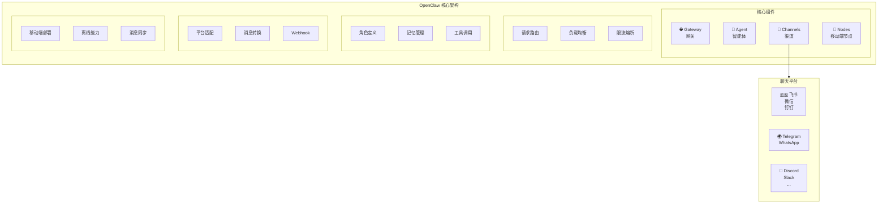

# 第1章：OpenClaw 是什么？

> 一个开源自托管 AI Agent 多渠道网关的全面解读

---

## 1.1 项目定位

OpenClaw 是一个开源的、自托管的 AI Agent 多渠道网关，采用 MIT 协议发布。简单来说，它是一座连接 AI 大模型和各类聊天平台的"桥梁"——让你的 AI 助手能够同时接入 WhatsApp、Telegram、Discord、微信、飞书等 20 多个聊天平台，用户在这些平台上的消息都会被统一转发给 AI 处理，再将 AI 的回复返回给用户。

### 核心特性一览

| 特性 | 说明 |
|------|------|
| **开源免费** | MIT 协议，可自由使用、修改、商用 |
| **自托管** | 数据完全掌控在自己手中，隐私无忧 |
| **多渠道** | 支持 20+ 聊天平台，一处配置，多端同步 |
| **多模型** | 支持 30+ LLM 提供商，灵活切换 |
| **技能生态** | 13000+ 社区技能，即装即用 |

---

## 1.2 它能做什么？

想象这样一个场景：你在飞书上布置了一个任务给 AI 助手，然后在 Telegram 上继续追问细节，晚上回到家又在 Discord 里查看执行结果——整个过程中，AI 助手始终记得对话上下文，无缝衔接。

这就是 OpenClaw 的核心价值：**打破平台壁垒，让 AI 助手无处不在**。

### 典型应用场景

**场景一：个人智能助手**
- 在微信公众号里询问"今天有什么重要日程"
- 在飞书里让 AI 总结一份文档
- 在 Telegram 上和 AI 闲聊
- 所有对话记录统一管理，AI 记得你的偏好

**场景二：企业客服机器人**
- 同时部署在微信、飞书、钉钉、官网
- 统一的知识库回答用户问题
- 复杂问题自动转人工，记录不丢失
- 一个后台管理所有渠道的消息

**场景三：内容运营自动化**
- 监控热点新闻，自动生成摘要
- 定时推送到多个社交平台
- AI 辅助内容改写和优化
- 数据统一汇总分析

---

## 1.3 架构概览

OpenClaw 采用模块化架构，由四个核心组件组成：

### Gateway（网关）

网关是整个系统的入口，负责：
- **请求路由**：将来自不同渠道的消息路由到对应的 Agent
- **负载均衡**：多实例部署时分配请求
- **限流熔断**：防止突发流量打垮系统
- **协议转换**：统一处理 HTTP/WebSocket/gRPC 等不同协议

### Agent（智能体）

Agent 是 AI 的核心逻辑层，负责：
- **角色定义**：通过 System Prompt 设定 AI 的身份和能力边界
- **记忆管理**：维护对话历史，支持短期记忆（上下文窗口）和长期记忆（向量数据库）
- **工具调用**：调用外部 Skill 完成特定任务
- **多轮对话**：管理复杂的对话状态

### Channels（渠道）

渠道层负责对接各类聊天平台：
- **平台适配器**：每个平台有独立的适配器，处理消息格式差异
- **Webhook 管理**：接收平台推送的消息事件
- **消息加解密**：处理微信、飞书等平台的加密消息
- **格式转换**：将平台消息转为 OpenClaw 内部标准格式

### Nodes（移动端节点）

Nodes 是可选的移动端组件：
- **移动端部署**：在手机或边缘设备上运行轻量级 Agent
- **离线能力**：弱网环境下缓存消息，恢复后同步
- **消息同步**：多端消息状态保持一致

---

## 1.4 与竞品的区别

市面上类似的 AI 平台不少，OpenClaw 的定位有何不同？

### OpenClaw vs Dify

| 对比项 | OpenClaw | Dify |
|--------|----------|------|
| 核心定位 | 多渠道网关 + Agent | AI 应用开发平台 |
| 渠道支持 | 20+ 即时通讯平台 | 主要是 Web 应用 |
| 部署方式 | 自托管为主 | 云服务 + 自托管 |
| 协议 | MIT（完全开源） | 部分开源 |
| 适用场景 | 多平台 Bot、客服 | 快速构建 AI 应用 |

**选择建议**：如果你需要让 AI 同时接入微信、飞书、Telegram 等多个聊天平台，选 OpenClaw；如果你主要是开发面向 Web 的 AI 应用，选 Dify。

### OpenClaw vs Coze（扣子）

| 对比项 | OpenClaw | Coze |
|--------|----------|------|
| 核心定位 | 自托管网关 | 云端 Bot 平台 |
| 数据隐私 | 完全自主可控 | 数据在字节云端 |
| 渠道支持 | 更广（含海外平台） | 主要国内平台 |
| 成本 | 服务器成本 | 按量付费 |
| 定制化 | 完全可定制 | 受平台限制 |

**选择建议**：如果对数据隐私要求高，或需要接入海外平台（Telegram、Discord 等），选 OpenClaw；如果追求快速上线、不想运维，选 Coze。

### OpenClaw vs n8n

| 对比项 | OpenClaw | n8n |
|--------|----------|-----|
| 核心定位 | AI Agent 网关 | 工作流自动化 |
| AI 能力 | 原生深度集成 | 需额外配置 |
| 对话管理 | 内置完整方案 | 需自行搭建 |
| 适用场景 | 智能对话 Bot | 业务流程自动化 |

**选择建议**：两者可以互补使用——用 n8n 处理业务流程自动化，用 OpenClaw 处理智能对话，通过 Webhook 互相调用。

---

## 1.5 适用人群

OpenClaw 适合以下人群使用：

### 技术开发者
- 有服务器运维经验
- 熟悉 Docker 和命令行
- 需要深度定制 AI Bot 的行为
- 希望将 AI 集成到现有系统中

### 技术爱好者
- 有自己的服务器或 NAS
- 喜欢折腾自托管服务
- 关注数据隐私
- 愿意学习新技术

### 中小企业技术团队
- 需要部署企业级 AI 客服
- 有内部系统对接需求
- 对数据安全有要求
- 希望降低长期成本

### 不适合的人群
- 完全没有技术背景的用户
- 追求开箱即用、不愿折腾的用户
- 只需要简单单平台 Bot 的用户

---

## 1.6 本章小结

OpenClaw 是一个面向技术用户的开源 AI Agent 多渠道网关，核心价值在于：

1. **统一入口**：一次配置，同时接入 20+ 聊天平台
2. **数据自主**：自托管部署，数据完全掌控
3. **灵活扩展**：13000+ 技能生态，支持自定义开发
4. **成本可控**：开源免费，仅需承担服务器成本

下一章，我们将通过 Docker Compose 在 5 分钟内完成 OpenClaw 的快速体验。

---

## 思考题

1. 你目前使用哪些聊天平台？希望在这些平台上使用 AI 助手吗？
2. 你对数据隐私的要求有多高？是否介意使用云端 AI 服务？
3. 你更倾向于"开箱即用"还是"完全可控"的解决方案？
