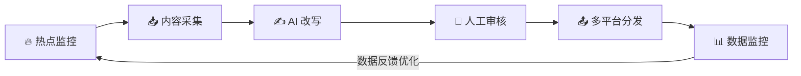
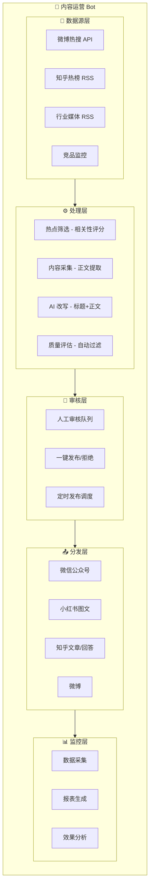

# 第13章：实战二——内容运营 Bot

> 自动化内容采集、AI 改写、多平台分发的完整方案

---

## 13.1 需求分析

### 场景定义

为自媒体/企业打造自动化内容运营机器人，实现从热点监控到多平台分发的全流程自动化。

### 业务流程



### 功能清单

| 模块 | 功能 | 说明 |
|------|------|------|
| 热点监控 | 监控微博热搜、知乎热榜、行业资讯 | 每小时扫描 |
| 内容采集 | RSS订阅、定向爬虫、API接入 | 自动提取正文 |
| AI 改写 | 标题优化、内容改写、风格迁移 | 多版本生成 |
| 多平台分发 | 公众号、小红书、知乎、微博 | 格式自动适配 |
| 数据监控 | 阅读量、互动数据抓取 | 效果追踪 |

---

## 13.2 架构设计



---

## 13.3 热点监控

### 数据源接入

```python
# skills/trend_monitor/trend_monitor.py
import requests
import feedparser
from typing import List, Dict
from datetime import datetime

class TrendMonitorSkill:
    def __init__(self):
        self.sources = {
            "weibo": {
                "url": "https://weibo.com/ajax/side/hotSearch",
                "type": "api"
            },
            "zhihu": {
                "url": "https://www.zhihu.com/rss",
                "type": "rss"
            },
            "36kr": {
                "url": "https://36kr.com/feed",
                "type": "rss"
            },
            "hackernews": {
                "url": "https://news.ycombinator.com/rss",
                "type": "rss"
            }
        }
    
    async def fetch_weibo_hot(self) -> List[Dict]:
        """获取微博热搜"""
        try:
            response = requests.get(
                self.sources["weibo"]["url"],
                headers={"User-Agent": "Mozilla/5.0"}
            )
            data = response.json()
            
            trends = []
            for item in data["data"]["realtime"]:
                trends.append({
                    "source": "weibo",
                    "title": item["note"],
                    "url": f"https://s.weibo.com/weibo?q={item['note']}",
                    "hot_value": item.get("num", 0),
                    "rank": item.get("rank", 0),
                    "category": item.get("category", "")
                })
            
            return trends[:20]  # 取前 20
        except Exception as e:
            print(f"获取微博热搜失败: {e}")
            return []
    
    async def fetch_zhihu_hot(self) -> List[Dict]:
        """获取知乎热榜"""
        try:
            feed = feedparser.parse(self.sources["zhihu"]["url"])
            
            trends = []
            for entry in feed.entries[:20]:
                trends.append({
                    "source": "zhihu",
                    "title": entry.title,
                    "url": entry.link,
                    "summary": entry.summary[:200],
                    "published": entry.published
                })
            
            return trends
        except Exception as e:
            print(f"获取知乎热榜失败: {e}")
            return []
    
    async def fetch_all_trends(self) -> List[Dict]:
        """获取所有热点"""
        all_trends = []
        
        all_trends.extend(await self.fetch_weibo_hot())
        all_trends.extend(await self.fetch_zhihu_hot())
        
        # 按热度排序
        all_trends.sort(key=lambda x: x.get("hot_value", 0), reverse=True)
        
        return all_trends
```

### 热点筛选

```python
class TrendFilter:
    def __init__(self, interest_keywords: List[str]):
        self.interest_keywords = interest_keywords
        self.blacklist = ["明星", "娱乐", "八卦"]  # 黑名单
    
    def score(self, trend: Dict) -> float:
        """计算热点与业务的相关性分数"""
        score = 0.0
        title = trend["title"].lower()
        
        # 关键词匹配加分
        for keyword in self.interest_keywords:
            if keyword in title:
                score += 1.0
        
        # 黑名单扣分
        for word in self.blacklist:
            if word in title:
                score -= 2.0
        
        # 热度加权
        hot_value = trend.get("hot_value", 0)
        if hot_value > 1000000:
            score += 0.5
        
        return score
    
    def filter(self, trends: List[Dict], threshold: float = 0.5) -> List[Dict]:
        """筛选相关热点"""
        scored = [(t, self.score(t)) for t in trends]
        scored.sort(key=lambda x: x[1], reverse=True)
        
        return [t for t, s in scored if s >= threshold]
```

---

## 13.4 内容采集

### 正文提取

```python
# skills/content_extractor/content_extractor.py
import requests
from bs4 import BeautifulSoup
from typing import Optional
import trafilatura

class ContentExtractor:
    def __init__(self):
        self.headers = {
            "User-Agent": "Mozilla/5.0 (Windows NT 10.0; Win64; x64) AppleWebKit/537.36"
        }
    
    async def extract(self, url: str) -> Optional[Dict]:
        """提取文章正文"""
        try:
            # 使用 trafilatura 提取正文（效果较好）
            downloaded = trafilatura.fetch_url(url)
            result = trafilatura.extract(
                downloaded,
                include_comments=False,
                include_tables=False,
                deduplicate=True,
                target_language="zh"
            )
            
            if not result:
                # 备用方案：BeautifulSoup
                result = await self._extract_with_bs4(url)
            
            # 获取标题
            title = self._extract_title(downloaded)
            
            return {
                "title": title,
                "content": result,
                "url": url,
                "word_count": len(result) if result else 0
            }
        except Exception as e:
            print(f"提取失败 {url}: {e}")
            return None
    
    async def _extract_with_bs4(self, url: str) -> str:
        """使用 BeautifulSoup 提取"""
        response = requests.get(url, headers=self.headers, timeout=10)
        soup = BeautifulSoup(response.content, 'html.parser')
        
        # 移除脚本和样式
        for script in soup(["script", "style"]):
            script.decompose()
        
        # 获取正文
        text = soup.get_text()
        
        # 清理空白
        lines = (line.strip() for line in text.splitlines())
        chunks = (phrase.strip() for line in lines for phrase in line.split("  "))
        text = '\n'.join(chunk for chunk in chunks if chunk)
        
        return text
    
    def _extract_title(self, html: str) -> str:
        """提取标题"""
        soup = BeautifulSoup(html, 'html.parser')
        
        # 尝试多种方式获取标题
        title = soup.find('h1')
        if title:
            return title.get_text().strip()
        
        title = soup.find('title')
        if title:
            return title.get_text().strip()
        
        return "无标题"
```

### 内容清洗

```python
class ContentCleaner:
    def clean(self, content: str) -> str:
        """清洗内容"""
        # 移除广告
        ad_patterns = [
            r"原标题[：:]",
            r"本文来源[：:]",
            r"责任编辑[：:]",
            r"声明[：:]",
            r"免责声明[：:]",
            r"推荐阅读[：:]",
            r"相关阅读[：:]",
        ]
        
        for pattern in ad_patterns:
            content = re.sub(pattern, "", content)
        
        # 移除多余空行
        content = re.sub(r'\n{3,}', '\n\n', content)
        
        # 移除特殊字符
        content = re.sub(r'[\x00-\x08\x0b-\x0c\x0e-\x1f]', '', content)
        
        return content.strip()
```

---

## 13.5 AI 改写

### 标题优化

```python
# skills/content_rewrite/title_optimizer.py
class TitleOptimizer:
    def __init__(self, llm_client):
        self.llm = llm_client
    
    async def optimize(self, original_title: str, count: int = 3) -> List[str]:
        """生成多个优化后的标题"""
        prompt = f"""
        原标题：{original_title}
        
        请生成 {count} 个优化后的标题，要求：
        1. 吸引眼球，提高点击率
        2. 保留原标题核心信息
        3. 适合社交媒体传播
        4. 每个标题不超过 20 个字
        5. 可以使用数字、疑问、对比等手法
        
        只返回标题列表，每行一个，不要编号。
        """
        
        response = await self.llm.generate(prompt)
        titles = [t.strip() for t in response.split('\n') if t.strip()]
        
        return titles[:count]
    
    async def optimize_for_platform(self, title: str, platform: str) -> str:
        """针对特定平台优化标题"""
        platform_prompts = {
            "xiaohongshu": """
                小红书风格：
                - 多用 emoji
                - 突出实用价值
                - 营造紧迫感
                - 口语化表达
            """,
            "zhihu": """
                知乎风格：
                - 专业严谨
                - 引发思考
                - 避免标题党
            """,
            "weibo": """
                微博风格：
                - 简短有力
                - 带话题标签
                - 引发讨论
            """
        }
        
        prompt = f"""
        原标题：{title}
        
        {platform_prompts.get(platform, "")}
        
        请生成一个适合该平台的标题。
        """
        
        return await self.llm.generate(prompt)
```

### 内容改写

```python
class ContentRewriter:
    def __init__(self, llm_client):
        self.llm = llm_client
    
    async def rewrite(self, content: str, style: str = "default") -> str:
        """改写内容"""
        style_prompts = {
            "default": "保持原意，优化表达，提高可读性",
            "xiaohongshu": """
                改写成小红书风格：
                - 开头用 emoji 吸引注意
                - 分段清晰，多用短句
                - 加入个人感受
                - 结尾引导互动
                - 适当使用 emoji
            """,
            "zhihu": """
                改写成知乎风格：
                - 结构清晰，逻辑严谨
                - 有理有据，数据支撑
                - 专业但不晦涩
                - 适当引用来源
            """,
            "wechat": """
                改写成公众号风格：
                - 开头抓人眼球
                - 故事化叙述
                - 金句频出
                - 结尾升华主题
            """
        }
        
        prompt = f"""
        请改写以下内容：
        
        {style_prompts.get(style, style_prompts['default'])}
        
        原文：
        {content[:3000]}  # 限制长度
        
        改写要求：
        1. 字数控制在 800-1500 字
        2. 保留核心信息
        3. 去除原文的冗余表达
        4. 增加可读性
        
        请直接输出改写后的内容。
        """
        
        return await self.llm.generate(prompt, max_tokens=2000)
```

---

## 13.6 多平台分发

### 平台适配器

```python
# skills/publisher/publisher.py
class MultiPlatformPublisher:
    def __init__(self):
        self.adapters = {
            "wechat": WechatAdapter(),
            "xiaohongshu": XiaohongshuAdapter(),
            "zhihu": ZhihuAdapter(),
            "weibo": WeiboAdapter()
        }
    
    async def publish(self, content: Dict, platforms: List[str]) -> Dict:
        """多平台发布"""
        results = {}
        
        for platform in platforms:
            adapter = self.adapters.get(platform)
            if not adapter:
                continue
            
            try:
                # 格式化内容
                formatted = adapter.format(content)
                
                # 发布
                result = await adapter.publish(formatted)
                results[platform] = {
                    "success": True,
                    "url": result.get("url"),
                    "id": result.get("id")
                }
            except Exception as e:
                results[platform] = {
                    "success": False,
                    "error": str(e)
                }
        
        return results
```

### 微信公众号适配

```python
class WechatAdapter:
    def format(self, content: Dict) -> Dict:
        """格式化为公众号文章"""
        return {
            "title": content["title"],
            "content": self._format_content(content["content"]),
            "thumb_media_id": content.get("cover_image"),
            "author": content.get("author", "运营助手"),
            "digest": content.get("summary", "")[:120]
        }
    
    def _format_content(self, content: str) -> str:
        """格式化正文为公众号 HTML"""
        # 转换 Markdown 为 HTML
        html = markdown.markdown(content)
        
        # 添加公众号样式
        styled_html = f"""
        <div style="font-size: 16px; line-height: 1.8; color: #333;">
            {html}
        </div>
        """
        
        return styled_html
    
    async def publish(self, formatted: Dict) -> Dict:
        """发布到公众号"""
        # 调用微信公众号 API
        access_token = await self._get_access_token()
        
        url = f"https://api.weixin.qq.com/cgi-bin/draft/add?access_token={access_token}"
        
        response = requests.post(url, json={
            "articles": [formatted]
        })
        
        return response.json()
```

### 小红书适配

```python
class XiaohongshuAdapter:
    def format(self, content: Dict) -> Dict:
        """格式化为小红书笔记"""
        # 提取关键内容
        text = content["content"]
        
        # 生成小红书风格内容
        formatted_text = f"""
{self._add_emojis(content["title"])}

{text[:500]}  # 小红书限制 1000 字

💡 关键点：
{self._extract_key_points(text)}

#{' #'.join(content.get('tags', ['干货', '分享']))}
        """.strip()
        
        return {
            "title": content["title"][:20],
            "content": formatted_text,
            "images": content.get("images", [])
        }
    
    def _add_emojis(self, text: str) -> str:
        """添加 emoji"""
        emojis = ["✨", "🔥", "💡", "📌", "🎯"]
        return f"{random.choice(emojis)} {text}"
    
    def _extract_key_points(self, text: str) -> str:
        """提取关键点"""
        # 使用 LLM 提取
        lines = text.split('\n')
        key_points = [line for line in lines if len(line) > 10][:3]
        return '\n'.join([f"• {p}" for p in key_points])
```

---

## 13.7 人工审核流程

### 审核队列

```yaml
# workflows/content-review.yaml
workflow:
  name: "内容审核"
  
  steps:
    - name: "生成内容"
      type: workflow
      workflow: "content-generation"
    
    - name: "发送审核通知"
      type: channel
      channel: "feishu"
      message: |
        📄 新内容待审核
        
        标题：{{steps.生成内容.title}}
        来源：{{steps.生成内容.source}}
        
        预览：
        {{steps.生成内容.preview}}
        
        操作：
        • 回复"通过"立即发布
        • 回复"定时 明天9点"定时发布
        • 回复"拒绝"放弃发布
        • 回复"修改 xxx"提供修改意见
    
    - name: "等待审核"
      type: wait
      timeout: 24h
      on_timeout: "reject"
    
    - name: "处理审核结果"
      type: condition
      conditions:
        - if: "{{input.action}} == '通过'"
          then:
            - type: workflow
              workflow: "publish-now"
        
        - if: "{{input.action}} == '定时'"
          then:
            - type: workflow
              workflow: "schedule-publish"
              input:
                time: "{{input.time}}"
        
        - if: "{{input.action}} == '拒绝'"
          then:
            - type: log
              message: "内容被拒绝"
```

---

## 13.8 数据监控

### 数据采集

```python
# skills/analytics/analytics.py
class ContentAnalytics:
    def __init__(self):
        self.db = None  # 数据库连接
    
    async def collect_wechat_stats(self, article_id: str) -> Dict:
        """采集公众号数据"""
        # 调用公众号数据分析接口
        access_token = await self._get_access_token()
        
        url = f"https://api.weixin.qq.com/datacube/getarticlesummary"
        
        response = requests.post(url, json={
            "access_token": access_token,
            "begin_date": "2024-01-01",
            "end_date": "2024-01-01"
        })
        
        data = response.json()
        
        return {
            "read_count": data.get("int_page_read_count", 0),
            "share_count": data.get("share_count", 0),
            "like_count": data.get("like_count", 0),
            "comment_count": data.get("comment_count", 0)
        }
    
    async def generate_report(self, start_date: str, end_date: str) -> str:
        """生成运营报表"""
        # 查询数据
        stats = await self.db.stats.find({
            "date": {"$gte": start_date, "$lte": end_date}
        }).to_list(length=None)
        
        # 汇总数据
        total_read = sum(s["read_count"] for s in stats)
        total_share = sum(s["share_count"] for s in stats)
        
        # 生成报告
        report = f"""
📊 运营周报 ({start_date} ~ {end_date})

📈 总体数据
• 总阅读量：{total_read}
• 总分享量：{total_share}
• 分享率：{total_share/total_read*100:.1f}%

📰 内容表现 TOP 3
{self._top_content(stats)}

💡 优化建议
{self._generate_suggestions(stats)}
        """
        
        return report
```

---

## 13.9 完整配置

```yaml
# config/content-bot.yaml
content_bot:
  # 监控配置
  monitoring:
    sources:
      - weibo
      - zhihu
      - 36kr
    keywords:
      - AI
      - 科技
      - 互联网
    schedule: "0 * * * *"  # 每小时
  
  # 改写配置
  rewriting:
    models:
      title: "deepseek-chat"
      content: "deepseek-chat"
    styles:
      - xiaohongshu
      - zhihu
      - wechat
  
  # 发布配置
  publishing:
    platforms:
      - wechat
      - xiaohongshu
      - zhihu
    auto_publish: false  # 需要人工审核
  
  # 审核配置
  review:
    channel: "feishu"
    timeout: 24h
  
  # 报告配置
  reporting:
    schedule: "0 9 * * 1"  # 每周一早 9 点
    channel: "feishu"
```

---

## 13.10 本章小结

本章实战构建了一个内容运营 Bot，包含：

1. **热点监控**：多平台热点采集与筛选
2. **内容采集**：正文提取与清洗
3. **AI 改写**：标题优化、风格迁移
4. **多平台分发**：格式自动适配
5. **人工审核**：审核队列与定时发布
6. **数据监控**：效果追踪与报表生成

**关键要点**：
- 内容改写需针对平台特性优化
- 人工审核环节不可省略，避免风险
- 数据监控指导内容策略优化

**风险提示**：
- 注意版权问题，改写后内容需人工审核
- 遵守各平台规则，避免封号
- 敏感内容需人工把关

