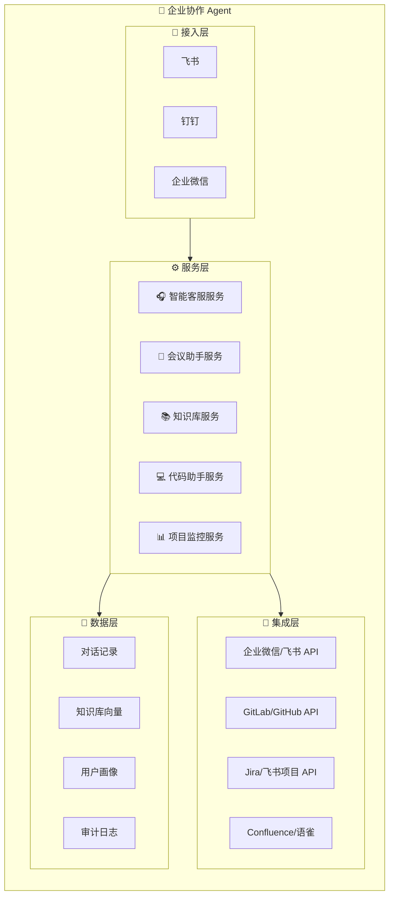

# 第14章：实战三——团队协作 Agent

> 企业级智能协作助手：客服、会议、知识库、代码审查一体化

---

## 14.1 需求分析

### 场景定义

为企业团队打造智能协作助手，整合智能客服、会议助手、知识库问答、代码审查等功能，提升团队协作效率。

### 功能模块

| 模块 | 功能 | 用户价值 |
|------|------|----------|
| 智能客服 | 自动回答产品咨询、技术支持 | 降低人工客服压力 |
| 会议助手 | 会议纪要生成、待办提取 | 提升会议效率 |
| 知识库问答 | 基于企业文档的 RAG | 快速获取内部知识 |
| 代码助手 | Git 提交信息生成、Code Review | 提升开发效率 |
| 项目监控 | Jira/飞书项目集成 | 项目进度追踪 |

---

## 14.2 架构设计



---

## 14.3 智能客服

### 客服 Agent 配置

```yaml
# config/agents/customer-service.yaml
agent:
  id: "customer-service"
  name: "客服助手"
  system_prompt: |
    你是 {company_name} 的智能客服助手。
    
    ## 服务范围
    1. 产品咨询：功能介绍、定价方案、购买流程
    2. 技术支持：使用指导、故障排查、常见问题
    3. 售后服务：退换货、发票、投诉建议
    
    ## 服务原则
    1. 首次响应时间不超过 30 秒
    2. 复杂问题提供分步骤指导
    3. 无法解决时主动转人工
    4. 保持礼貌、耐心、专业
    
    ## 转人工条件
    - 用户明确要求转人工
    - 涉及退款/投诉/法律问题
    - 连续 3 次未能解决问题
    - 用户情绪激烈
    
    ## 话术规范
    - 开头："您好，我是客服助手，很高兴为您服务"
    - 结尾："请问还有其他可以帮您的吗？"
    - 转人工："这个问题需要人工协助，正在为您转接..."
  
  model: "deepseek-chat"
  
  tools:
    - search_knowledge_base
    - query_order
    - create_ticket
    - transfer_to_human
  
  memory:
    short_term:
      max_messages: 10
    long_term:
      enabled: true
      categories:
        - user_issues
        - resolution_history
```

### 知识库检索

```python
# skills/customer_service/knowledge_base.py
from langchain_community.vectorstores import Chroma
from langchain_openai import OpenAIEmbeddings

class CustomerKnowledgeBase:
    def __init__(self, persist_dir: str):
        self.embeddings = OpenAIEmbeddings(
            model="text-embedding-3-small"
        )
        self.vectorstore = Chroma(
            persist_directory=persist_dir,
            embedding_function=self.embeddings
        )
    
    async def search(self, query: str, top_k: int = 3) -> List[Dict]:
        """搜索知识库"""
        docs = self.vectorstore.similarity_search(
            query,
            k=top_k
        )
        
        results = []
        for doc in docs:
            results.append({
                "content": doc.page_content,
                "source": doc.metadata.get("source"),
                "category": doc.metadata.get("category"),
                "score": doc.metadata.get("score")
            })
        
        return results
    
    async def answer(self, question: str) -> Dict:
        """基于知识库回答问题"""
        # 检索相关知识
        knowledge = await self.search(question)
        
        if not knowledge:
            return {
                "found": False,
                "answer": "抱歉，我暂时无法回答这个问题，正在为您转接人工客服...",
                "confidence": 0
            }
        
        # 构建上下文
        context = "\n\n".join([k["content"] for k in knowledge])
        
        # 生成答案
        prompt = f"""
        基于以下知识库内容回答用户问题：
        
        知识库内容：
        {context}
        
        用户问题：{question}
        
        要求：
        1. 只基于知识库内容回答
        2. 如果知识库中没有相关信息，明确说明
        3. 回答简洁明了
        """
        
        answer = await self.llm.generate(prompt)
        
        return {
            "found": True,
            "answer": answer,
            "sources": [k["source"] for k in knowledge],
            "confidence": self._calculate_confidence(knowledge)
        }
```

### 工单系统对接

```python
class TicketSystem:
    def __init__(self, api_key: str, base_url: str):
        self.api_key = api_key
        self.base_url = base_url
    
    async def create_ticket(
        self,
        user_id: str,
        issue_type: str,
        description: str,
        priority: str = "normal"
    ) -> Dict:
        """创建工单"""
        url = f"{self.base_url}/api/v1/tickets"
        
        payload = {
            "user_id": user_id,
            "type": issue_type,
            "description": description,
            "priority": priority,
            "source": "ai_agent",
            "created_at": datetime.now().isoformat()
        }
        
        response = requests.post(
            url,
            json=payload,
            headers={"Authorization": f"Bearer {self.api_key}"}
        )
        
        return response.json()
    
    async def get_ticket_status(self, ticket_id: str) -> Dict:
        """查询工单状态"""
        url = f"{self.base_url}/api/v1/tickets/{ticket_id}"
        
        response = requests.get(
            url,
            headers={"Authorization": f"Bearer {self.api_key}"}
        )
        
        return response.json()
```

---

## 14.4 会议助手

### 会议纪要生成

```python
# skills/meeting/meeting_assistant.py
import openai
from typing import List, Dict

class MeetingAssistant:
    def __init__(self):
        self.client = openai.AsyncOpenAI()
    
    async def generate_summary(
        self,
        transcript: str,
        meeting_title: str = ""
    ) -> Dict:
        """生成会议纪要"""
        
        prompt = f"""
        请根据以下会议录音转录文本生成会议纪要：
        
        会议主题：{meeting_title}
        
        转录文本：
        {transcript[:8000]}  # 限制长度
        
        请按以下格式输出：
        
        ## 会议信息
        - 时间：
        - 参与人：
        - 主题：
        
        ## 会议要点
        1. 
        2. 
        3. 
        
        ## 决策事项
        - 
        
        ## 待办事项
        - [ ] 任务1（负责人）
        - [ ] 任务2（负责人）
        
        ## 下一步计划
        - 
        """
        
        response = await self.client.chat.completions.create(
            model="gpt-4",
            messages=[{"role": "user", "content": prompt}],
            temperature=0.3
        )
        
        summary = response.choices[0].message.content
        
        # 提取待办事项
        todos = self._extract_todos(summary)
        
        return {
            "summary": summary,
            "todos": todos,
            "participants": self._extract_participants(transcript)
        }
    
    def _extract_todos(self, summary: str) -> List[Dict]:
        """提取待办事项"""
        todos = []
        
        # 使用正则提取待办
        import re
        pattern = r'- \[ \] (.+?)(?:（(.+?)）|$)'
        matches = re.findall(pattern, summary)
        
        for task, assignee in matches:
            todos.append({
                "task": task.strip(),
                "assignee": assignee.strip() if assignee else "",
                "status": "pending"
            })
        
        return todos
    
    async def send_summary(
        self,
        summary: Dict,
        channel: str,
        participants: List[str]
    ):
        """发送会议纪要"""
        message = f"""
📄 会议纪要

{summary['summary']}

@{' @'.join(participants)}
        """
        
        # 发送到指定渠道
        await self._send_to_channel(channel, message)
        
        # 创建待办任务
        for todo in summary['todos']:
            await self._create_task(todo)
```

### 飞书会议集成

```python
class FeishuMeetingIntegration:
    def __init__(self, app_id: str, app_secret: str):
        self.app_id = app_id
        self.app_secret = app_secret
        self.access_token = None
    
    async def get_meeting_record(self, meeting_id: str) -> Dict:
        """获取会议录制"""
        token = await self._get_access_token()
        
        url = f"https://open.feishu.cn/open-apis/vc/v1/meetings/{meeting_id}/recording"
        
        response = requests.get(
            url,
            headers={"Authorization": f"Bearer {token}"}
        )
        
        return response.json()
    
    async def get_meeting_transcript(self, meeting_id: str) -> str:
        """获取会议转录文本"""
        # 获取转录文件 URL
        record = await self.get_meeting_record(meeting_id)
        transcript_url = record["data"]["transcript_url"]
        
        # 下载转录文本
        response = requests.get(transcript_url)
        
        return response.text
```

---

## 14.5 知识库问答

### 企业知识库构建

```python
# skills/knowledge/enterprise_kb.py
from langchain_community.document_loaders import (
    UnstructuredFileLoader,
    ConfluenceLoader,
    NotionDBLoader
)
from langchain.text_splitter import RecursiveCharacterTextSplitter

class EnterpriseKnowledgeBase:
    def __init__(self, vector_store_path: str):
        self.vector_store_path = vector_store_path
        self.text_splitter = RecursiveCharacterTextSplitter(
            chunk_size=500,
            chunk_overlap=50,
            separators=["\n\n", "\n", "。", " "]
        )
    
    async def load_from_confluence(
        self,
        url: str,
        username: str,
        api_key: str,
        space_key: str
    ):
        """从 Confluence 加载文档"""
        loader = ConfluenceLoader(
            url=url,
            username=username,
            api_key=api_key
        )
        
        documents = loader.load(
            space_key=space_key,
            include_attachments=False,
            limit=1000
        )
        
        # 分割文档
        chunks = self.text_splitter.split_documents(documents)
        
        # 存入向量数据库
        await self._store_documents(chunks)
        
        return len(chunks)
    
    async def load_from_notion(
        self,
        database_id: str,
        api_key: str
    ):
        """从 Notion 加载文档"""
        loader = NotionDBLoader(
            database_id=database_id,
            notion_token=api_key
        )
        
        documents = loader.load()
        chunks = self.text_splitter.split_documents(documents)
        await self._store_documents(chunks)
        
        return len(chunks)
    
    async def load_local_files(self, directory: str):
        """加载本地文件"""
        from pathlib import Path
        
        documents = []
        
        for file_path in Path(directory).rglob("*"):
            if file_path.suffix in ['.pdf', '.docx', '.txt', '.md']:
                loader = UnstructuredFileLoader(str(file_path))
                docs = loader.load()
                documents.extend(docs)
        
        chunks = self.text_splitter.split_documents(documents)
        await self._store_documents(chunks)
        
        return len(chunks)
```

### 权限控制

```python
class KnowledgeBaseACL:
    def __init__(self):
        self.permissions = {}
    
    def set_document_permission(
        self,
        doc_id: str,
        allowed_roles: List[str],
        allowed_users: List[str] = None
    ):
        """设置文档权限"""
        self.permissions[doc_id] = {
            "roles": allowed_roles,
            "users": allowed_users or []
        }
    
    def can_access(self, user: Dict, doc_id: str) -> bool:
        """检查用户是否有权限访问文档"""
        if doc_id not in self.permissions:
            return True  # 默认公开
        
        perm = self.permissions[doc_id]
        
        # 检查角色
        if user.get("role") in perm["roles"]:
            return True
        
        # 检查用户
        if user.get("id") in perm["users"]:
            return True
        
        return False
    
    async def search_with_acl(
        self,
        query: str,
        user: Dict,
        top_k: int = 5
    ) -> List[Dict]:
        """带权限控制的搜索"""
        # 先搜索所有结果
        all_results = await self.vectorstore.search(query, top_k=top_k*2)
        
        # 过滤无权限的文档
        filtered = [
            r for r in all_results
            if self.can_access(user, r["metadata"]["doc_id"])
        ]
        
        return filtered[:top_k]
```

---

## 14.6 代码助手

### Git 提交信息生成

```python
# skills/code/git_assistant.py
import subprocess
from typing import List

class GitAssistant:
    async def generate_commit_message(
        self,
        repo_path: str,
        diff: str = None
    ) -> str:
        """生成提交信息"""
        
        if not diff:
            # 获取暂存区变更
            diff = subprocess.run(
                ["git", "-C", repo_path, "diff", "--staged"],
                capture_output=True,
                text=True
            ).stdout
        
        if not diff.strip():
            return "没有暂存的变更"
        
        # 使用 LLM 生成提交信息
        prompt = f"""
        根据以下 Git diff 生成符合 Conventional Commits 规范的提交信息：
        
        ```diff
        {diff[:3000]}
        ```
        
        要求：
        1. 格式：type(scope): subject
        2. type 可选：feat, fix, docs, style, refactor, test, chore
        3. subject 不超过 50 个字符
        4. 使用英文
        5. 只返回提交信息，不要其他内容
        
        示例：
        feat(auth): add OAuth2 login support
        fix(api): resolve null pointer exception
        docs(readme): update installation guide
        """
        
        message = await self.llm.generate(prompt, max_tokens=100)
        
        return message.strip()
    
    async def suggest_commit_messages(
        self,
        repo_path: str,
        count: int = 3
    ) -> List[str]:
        """生成多个提交信息建议"""
        diff = subprocess.run(
            ["git", "-C", repo_path, "diff", "--staged"],
            capture_output=True,
            text=True
        ).stdout
        
        prompt = f"""
        根据以下 Git diff 生成 {count} 个提交信息建议：
        
        ```diff
        {diff[:3000]}
        ```
        
        每个建议一行，格式：type(scope): subject
        """
        
        response = await self.llm.generate(prompt)
        
        messages = [m.strip() for m in response.split('\n') if m.strip()]
        return messages[:count]
```

### Code Review

```python
class CodeReviewer:
    async def review_pr(
        self,
        repo: str,
        pr_number: int
    ) -> Dict:
        """审查 PR"""
        # 获取 PR 信息
        pr = await self.github.get_pr(repo, pr_number)
        
        # 获取变更文件
        files = await self.github.get_pr_files(repo, pr_number)
        
        reviews = []
        
        for file in files:
            if file["status"] == "removed":
                continue
            
            # 获取文件内容
            content = await self.github.get_file_content(
                repo,
                file["filename"],
                pr["head"]["sha"]
            )
            
            # 代码审查
            review = await self._review_file(
                file["filename"],
                content,
                file.get("patch", "")
            )
            
            if review["issues"]:
                reviews.append(review)
        
        # 生成总结
        summary = await self._generate_review_summary(reviews)
        
        return {
            "summary": summary,
            "file_reviews": reviews,
            "approve": len(reviews) == 0
        }
    
    async def _review_file(
        self,
        filename: str,
        content: str,
        patch: str
    ) -> Dict:
        """审查单个文件"""
        
        prompt = f"""
        请审查以下代码变更，指出潜在问题：
        
        文件：{filename}
        
        变更：
        ```diff
        {patch}
        ```
        
        请检查：
        1. 代码风格问题
        2. 潜在的 bug
        3. 安全问题
        4. 性能问题
        5. 可维护性问题
        
        格式：
        - [级别] 问题描述（行号）
        
        级别：INFO, WARNING, ERROR
        """
        
        response = await self.llm.generate(prompt)
        
        # 解析审查结果
        issues = self._parse_issues(response)
        
        return {
            "filename": filename,
            "issues": issues
        }
```

---

## 14.7 项目监控

### Jira 集成

```python
# skills/project/jira_integration.py
class JiraIntegration:
    def __init__(self, server: str, username: str, api_token: str):
        self.server = server
        self.auth = (username, api_token)
    
    async def get_project_status(self, project_key: str) -> Dict:
        """获取项目状态"""
        url = f"{self.server}/rest/api/2/search"
        
        # 查询项目下所有任务
        params = {
            "jql": f"project = {project_key}",
            "fields": "status,assignee,summary,priority"
        }
        
        response = requests.get(url, params=params, auth=self.auth)
        data = response.json()
        
        # 统计
        issues = data["issues"]
        
        status_count = {}
        for issue in issues:
            status = issue["fields"]["status"]["name"]
            status_count[status] = status_count.get(status, 0) + 1
        
        return {
            "total": len(issues),
            "by_status": status_count,
            "issues": issues
        }
    
    async def get_sprint_status(self, board_id: int) -> Dict:
        """获取 Sprint 状态"""
        # 获取活跃 Sprint
        url = f"{self.server}/rest/agile/1.0/board/{board_id}/sprint"
        
        response = requests.get(url, auth=self.auth)
        sprints = response.json()["values"]
        
        active_sprint = None
        for sprint in sprints:
            if sprint["state"] == "active":
                active_sprint = sprint
                break
        
        if not active_sprint:
            return {"error": "没有活跃的 Sprint"}
        
        # 获取 Sprint 中的任务
        issues_url = f"{self.server}/rest/agile/1.0/sprint/{active_sprint['id']}/issue"
        issues_resp = requests.get(issues_url, auth=self.auth)
        issues = issues_resp.json()["issues"]
        
        # 统计完成度
        total = len(issues)
        completed = sum(1 for i in issues if i["fields"]["status"]["name"] == "Done")
        
        return {
            "sprint_name": active_sprint["name"],
            "total": total,
            "completed": completed,
            "progress": f"{completed}/{total} ({completed/total*100:.1f}%)",
            "end_date": active_sprint.get("endDate")
        }
```

### 飞书项目集成

```python
class FeishuProjectIntegration:
    def __init__(self, app_id: str, app_secret: str):
        self.app_id = app_id
        self.app_secret = app_secret
    
    async def get_project_tasks(self, project_key: str) -> List[Dict]:
        """获取项目任务"""
        token = await self._get_access_token()
        
        url = "https://open.feishu.cn/open-apis/project/v2/tasks"
        
        response = requests.get(
            url,
            headers={"Authorization": f"Bearer {token}"},
            params={"project_key": project_key}
        )
        
        return response.json()["data"]["items"]
    
    async def send_daily_report(self, project_key: str, channel: str):
        """发送项目日报"""
        tasks = await self.get_project_tasks(project_key)
        
        # 统计
        today_completed = []
        in_progress = []
        overdue = []
        
        for task in tasks:
            if task["status"]["name"] == "已完成":
                if self._is_completed_today(task):
                    today_completed.append(task)
            elif task["status"]["name"] == "进行中":
                in_progress.append(task)
            
            if self._is_overdue(task):
                overdue.append(task)
        
        # 生成报告
        report = f"""
📊 项目日报 - {project_key}

✅ 今日完成 ({len(today_completed)})
{self._format_task_list(today_completed)}

🔄 进行中 ({len(in_progress)})
{self._format_task_list(in_progress)}

⚠️ 已逾期 ({len(overdue)})
{self._format_task_list(overdue)}
        """
        
        await self._send_to_channel(channel, report)
```

---

## 14.8 完整配置

```yaml
# config/enterprise-agent.yaml
enterprise_agent:
  # 客服配置
  customer_service:
    enabled: true
    knowledge_base_path: "/data/kb"
    escalation_threshold: 3
    working_hours: "9:00-18:00"
  
  # 会议助手配置
  meeting_assistant:
    enabled: true
    auto_generate_summary: true
    extract_todos: true
  
  # 知识库配置
  knowledge_base:
    enabled: true
    sources:
      - type: confluence
        url: "https://wiki.company.com"
        space: "TEAM"
      - type: notion
        database_id: "xxx"
      - type: local
        path: "/data/docs"
    enable_acl: true
  
  # 代码助手配置
  code_assistant:
    enabled: true
    git_providers:
      - type: github
        token: "${GITHUB_TOKEN}"
      - type: gitlab
        url: "https://gitlab.company.com"
        token: "${GITLAB_TOKEN}"
  
  # 项目监控配置
  project_monitor:
    enabled: true
    sources:
      - type: jira
        server: "https://jira.company.com"
      - type: feishu_project
    daily_report:
      enabled: true
      schedule: "0 18 * * *"
      channel: "feishu"
```

---

## 14.9 本章小结

本章实战构建了一个企业级团队协作 Agent，包含：

1. **智能客服**：基于知识库的自动问答，支持工单创建和人工转接
2. **会议助手**：会议纪要自动生成、待办提取、飞书集成
3. **知识库问答**：Confluence/Notion/本地文档接入，支持权限控制
4. **代码助手**：Git 提交信息生成、Code Review
5. **项目监控**：Jira/飞书项目集成，日报自动生成

**部署要点**：
- 使用企业微信/飞书作为接入渠道
- 配置多租户隔离和权限控制
- 启用审计日志满足合规要求

**注意事项**：
- 知识库权限需要精细化管理
- 代码审查结果仅供参考，不能替代人工审查
- 涉及敏感操作的需人工确认

