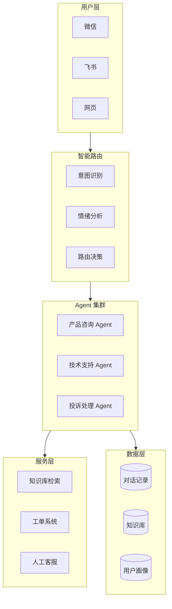

# 第15章：实战四——智能客服系统（进阶）

> 企业级智能客服：多轮对话、工单流转、人工接管、数据分析

---

## 15.1 需求分析

### 场景定义

构建企业级智能客服系统，处理产品咨询、技术支持、售后服务等场景，支持复杂多轮对话，必要时无缝转接人工。

### 功能清单

| 模块 | 功能 | 说明 |
|------|------|------|
| 意图识别 | 自动识别用户问题类型 | 产品咨询/技术支持/投诉建议 |
| 多轮对话 | 上下文理解、追问澄清 | 状态机管理 |
| 知识库问答 | 基于文档的精准回答 | RAG + 语义检索 |
| 工单系统 | 自动创建、流转、跟踪 | 与现有工单系统集成 |
| 人工接管 | 智能转人工、会话移交 | 无缝切换 |
| 满意度评价 | 自动邀请评价、数据分析 | NPS 评分 |

---

## 15.2 系统架构



---

## 15.3 意图识别与问题分类

### 意图识别模型

```python
# skills/intent_classifier/intent_classifier.py
from typing import Dict, List
import openai

class IntentClassifier:
    def __init__(self, model: str = "deepseek-chat"):
        self.model = model
        self.intents = {
            "product_inquiry": {
                "name": "产品咨询",
                "keywords": ["价格", "功能", "购买", "套餐", "试用"],
                "priority": 1
            },
            "technical_support": {
                "name": "技术支持",
                "keywords": ["报错", "无法", "失败", "怎么设置", "如何配置"],
                "priority": 2
            },
            "billing_issue": {
                "name": "账单问题",
                "keywords": ["发票", "退款", "扣费", "账单", "支付"],
                "priority": 1
            },
            "complaint": {
                "name": "投诉建议",
                "keywords": ["投诉", "不满", "太差", "垃圾", "退款"],
                "priority": 3  # 高优先级
            },
            "other": {
                "name": "其他",
                "keywords": [],
                "priority": 1
            }
        }
    
    async def classify(self, message: str, context: List[Dict] = None) -> Dict:
        """识别用户意图"""
        
        # 构建提示词
        intent_list = "\n".join([
            f"- {key}: {value['name']}"
            for key, value in self.intents.items()
        ])
        
        prompt = f"""
        请分析用户消息，判断其意图类别。
        
        可选意图：
        {intent_list}
        
        用户消息：{message}
        
        请返回 JSON 格式：
        {{
            "intent": "意图代码",
            "confidence": 0.95,
            "reason": "判断理由"
        }}
        """
        
        response = await openai.ChatCompletion.acreate(
            model=self.model,
            messages=[{"role": "user", "content": prompt}],
            temperature=0.3
        )
        
        result = response.choices[0].message.content
        # 解析 JSON 结果
        import json
        parsed = json.loads(result)
        
        return {
            "intent": parsed["intent"],
            "confidence": parsed["confidence"],
            "reason": parsed["reason"],
            "priority": self.intents[parsed["intent"]]["priority"]
        }
    
    async def extract_entities(self, message: str) -> Dict:
        """提取关键实体"""
        
        prompt = f"""
        从用户消息中提取关键信息实体。
        
        用户消息：{message}
        
        请提取以下实体（如存在）：
        - 订单号
        - 产品名称
        - 问题类型
        - 紧急程度
        
        返回 JSON 格式。
        """
        
        response = await openai.ChatCompletion.acreate(
            model=self.model,
            messages=[{"role": "user", "content": prompt}],
            temperature=0.3
        )
        
        import json
        return json.loads(response.choices[0].message.content)
```

### 情绪分析

```python
class SentimentAnalyzer:
    async def analyze(self, message: str) -> Dict:
        """分析用户情绪"""
        
        prompt = f"""
        分析以下用户消息的情绪状态：
        
        消息：{message}
        
        请判断：
        1. 情绪类型（积极/中性/消极/愤怒）
        2. 紧急程度（1-5）
        3. 是否需要人工介入
        
        返回 JSON 格式。
        """
        
        response = await openai.ChatCompletion.acreate(
            model="deepseek-chat",
            messages=[{"role": "user", "content": prompt}],
            temperature=0.3
        )
        
        import json
        result = json.loads(response.choices[0].message.content)
        
        return {
            "sentiment": result["情绪类型"],
            "urgency": result["紧急程度"],
            "need_human": result["需要人工介入"],
            "suggested_action": result.get("建议操作", "")
        }
```

---

## 15.4 多轮对话状态管理

### 对话状态机

```python
from enum import Enum, auto
from typing import Dict, Optional, List
from dataclasses import dataclass, field

class DialogState(Enum):
    INIT = auto()           # 初始状态
    GREETING = auto()       # 问候
    PROBLEM_CLARIFY = auto()  # 问题澄清
    SOLUTION_OFFER = auto()   # 提供方案
    CONFIRMATION = auto()     # 确认解决
    ESCALATION = auto()       # 转人工
    CLOSED = auto()           # 结束

@dataclass
class DialogContext:
    state: DialogState = DialogState.INIT
    intent: Optional[str] = None
    entities: Dict = field(default_factory=dict)
    history: List[Dict] = field(default_factory=list)
    pending_info: List[str] = field(default_factory=list)
    collected_info: Dict = field(default_factory=dict)
    escalation_reason: Optional[str] = None

class DialogManager:
    def __init__(self):
        self.contexts: Dict[str, DialogContext] = {}
    
    def get_context(self, session_id: str) -> DialogContext:
        """获取或创建对话上下文"""
        if session_id not in self.contexts:
            self.contexts[session_id] = DialogContext()
        return self.contexts[session_id]
    
    async def process_message(
        self,
        session_id: str,
        message: str,
        user_info: Dict
    ) -> Dict:
        """处理用户消息"""
        
        context = self.get_context(session_id)
        
        # 记录历史
        context.history.append({
            "role": "user",
            "content": message,
            "timestamp": datetime.now().isoformat()
        })
        
        # 状态机处理
        if context.state == DialogState.INIT:
            return await self._handle_init(context, message, user_info)
        
        elif context.state == DialogState.PROBLEM_CLARIFY:
            return await self._handle_clarify(context, message)
        
        elif context.state == DialogState.SOLUTION_OFFER:
            return await self._handle_solution(context, message)
        
        elif context.state == DialogState.CONFIRMATION:
            return await self._handle_confirmation(context, message)
        
        else:
            return await self._handle_default(context, message)
    
    async def _handle_init(self, context: DialogContext, message: str, user_info: Dict) -> Dict:
        """初始状态处理"""
        
        # 意图识别
        intent_result = await self.intent_classifier.classify(message)
        context.intent = intent_result["intent"]
        
        # 如果是投诉或高优先级，直接转人工
        if intent_result["priority"] >= 3:
            context.state = DialogState.ESCALATION
            context.escalation_reason = "高优先级问题"
            return {
                "type": "escalation",
                "message": "您的问题需要人工协助，正在为您转接...",
                "reason": context.escalation_reason
            }
        
        # 提取实体
        entities = await self.intent_classifier.extract_entities(message)
        context.entities = entities
        
        # 判断是否需要澄清
        if self._need_clarification(context):
            context.state = DialogState.PROBLEM_CLARIFY
            context.pending_info = self._get_missing_info(context)
            return {
                "type": "clarify",
                "message": self._generate_clarify_question(context)
            }
        
        # 直接进入解决方案
        context.state = DialogState.SOLUTION_OFFER
        return await self._generate_solution(context)
    
    def _need_clarification(self, context: DialogContext) -> bool:
        """判断是否需要澄清"""
        required_fields = {
            "technical_support": ["product_version", "error_message"],
            "billing_issue": ["order_id", "issue_type"],
            "product_inquiry": ["product_name"]
        }
        
        intent = context.intent
        if intent not in required_fields:
            return False
        
        for field in required_fields[intent]:
            if field not in context.entities or not context.entities[field]:
                return True
        
        return False
```

---

## 15.5 知识库 RAG 优化

### 混合检索策略

```python
from typing import List, Dict
import numpy as np

class HybridRetriever:
    def __init__(self, vector_store, keyword_store):
        self.vector_store = vector_store
        self.keyword_store = keyword_store
    
    async def retrieve(
        self,
        query: str,
        top_k: int = 5,
        alpha: float = 0.7  # 向量检索权重
    ) -> List[Dict]:
        """混合检索"""
        
        # 向量检索
        vector_results = await self.vector_store.similarity_search(
            query, k=top_k * 2
        )
        
        # 关键词检索
        keyword_results = await self.keyword_store.search(
            query, limit=top_k * 2
        )
        
        # 融合排序
        fused_results = self._fuse_results(
            vector_results,
            keyword_results,
            alpha
        )
        
        return fused_results[:top_k]
    
    def _fuse_results(
        self,
        vector_results: List[Dict],
        keyword_results: List[Dict],
        alpha: float
    ) -> List[Dict]:
        """融合两种检索结果"""
        
        # 归一化分数
        all_results = {}
        
        for i, result in enumerate(vector_results):
            doc_id = result["id"]
            score = 1 - (i / len(vector_results))  # 归一化到 0-1
            all_results[doc_id] = {
                "doc": result,
                "vector_score": score,
                "keyword_score": 0
            }
        
        for i, result in enumerate(keyword_results):
            doc_id = result["id"]
            score = 1 - (i / len(keyword_results))
            if doc_id in all_results:
                all_results[doc_id]["keyword_score"] = score
            else:
                all_results[doc_id] = {
                    "doc": result,
                    "vector_score": 0,
                    "keyword_score": score
                }
        
        # 计算融合分数
        for doc_id, data in all_results.items():
            data["final_score"] = (
                alpha * data["vector_score"] +
                (1 - alpha) * data["keyword_score"]
            )
        
        # 排序
        sorted_results = sorted(
            all_results.values(),
            key=lambda x: x["final_score"],
            reverse=True
        )
        
        return [item["doc"] for item in sorted_results]
```

### 重排序优化

```python
class Reranker:
    async def rerank(
        self,
        query: str,
        documents: List[Dict],
        top_k: int = 3
    ) -> List[Dict]:
        """对检索结果重排序"""
        
        # 使用 cross-encoder 进行精排
        pairs = [(query, doc["content"]) for doc in documents]
        
        scores = await self.cross_encoder.predict(pairs)
        
        # 按分数排序
        for doc, score in zip(documents, scores):
            doc["rerank_score"] = score
        
        sorted_docs = sorted(
            documents,
            key=lambda x: x["rerank_score"],
            reverse=True
        )
        
        return sorted_docs[:top_k]
```

---

## 15.6 人工接管机制

### 智能转人工

```python
class EscalationManager:
    def __init__(self):
        self.escalation_rules = [
            {
                "name": "高优先级问题",
                "condition": lambda ctx: ctx.intent == "complaint",
                "priority": 1
            },
            {
                "name": "用户明确要求",
                "condition": lambda ctx: "人工" in ctx.history[-1]["content"],
                "priority": 1
            },
            {
                "name": "多次未解决",
                "condition": lambda ctx: len(ctx.history) > 6,
                "priority": 2
            },
            {
                "name": "情绪愤怒",
                "condition": lambda ctx: ctx.sentiment == "angry",
                "priority": 1
            }
        ]
    
    def should_escalate(self, context: DialogContext) -> tuple[bool, str]:
        """判断是否需要转人工"""
        
        for rule in self.escalation_rules:
            if rule["condition"](context):
                return True, rule["name"]
        
        return False, ""
    
    async def escalate(
        self,
        session_id: str,
        context: DialogContext,
        reason: str
    ) -> Dict:
        """执行转人工"""
        
        # 1. 保存对话上下文
        await self._save_conversation_history(session_id, context)
        
        # 2. 查找可用客服
        available_agent = await self._find_available_agent()
        
        # 3. 创建转接会话
        handoff_session = await self._create_handoff_session(
            session_id,
            available_agent,
            context,
            reason
        )
        
        # 4. 通知用户
        return {
            "type": "handoff",
            "message": f"已为您转接人工客服，客服 {available_agent['name']} 将为您服务",
            "wait_time": "预计等待 2 分钟",
            "session_id": handoff_session["id"]
        }
```

### 会话移交

```python
class SessionHandoff:
    async def transfer_to_human(
        self,
        bot_session_id: str,
        human_agent_id: str
    ) -> Dict:
        """移交会话给人工"""
        
        # 获取对话历史
        history = await self.get_conversation_history(bot_session_id)
        
        # 生成会话摘要
        summary = await self._generate_summary(history)
        
        # 创建人工会话
        human_session = await self._create_human_session(
            user_id=history["user_id"],
            agent_id=human_agent_id,
            summary=summary,
            context=history
        )
        
        # 通知人工客服
        await self._notify_agent(human_agent_id, {
            "type": "new_session",
            "session_id": human_session["id"],
            "summary": summary,
            "priority": history.get("priority", "normal"),
            "user_info": history["user_info"]
        })
        
        return human_session
    
    async def _generate_summary(self, history: Dict) -> str:
        """生成对话摘要"""
        
        messages = history["messages"]
        
        prompt = f"""
        请总结以下客服对话的关键信息：
        
        对话记录：
        {messages}
        
        请总结：
        1. 用户问题
        2. 已尝试的解决方案
        3. 未解决的原因
        4. 建议处理方式
        """
        
        response = await openai.ChatCompletion.acreate(
            model="deepseek-chat",
            messages=[{"role": "user", "content": prompt}]
        )
        
        return response.choices[0].message.content
```

---

## 15.7 满意度评价与数据分析

### 自动邀请评价

```python
class SatisfactionSurvey:
    async def request_feedback(
        self,
        session_id: str,
        channel: str,
        user_id: str
    ):
        """请求用户评价"""
        
        # 延迟发送（会话结束后5分钟）
        await asyncio.sleep(300)
        
        # 检查是否已评价
        if await self._already_rated(session_id):
            return
        
        # 发送评价邀请
        message = """
        感谢您的咨询！🙏
        
        请对本次服务进行评价：
        1. ⭐ 非常满意
        2. ⭐⭐ 满意
        3. ⭐⭐⭐ 一般
        4. ⭐⭐⭐⭐ 不满意
        5. ⭐⭐⭐⭐⭐ 非常不满意
        
        回复数字 1-5 即可
        """
        
        await self.send_message(channel, user_id, message)
    
    async def collect_feedback(
        self,
        session_id: str,
        rating: int,
        comment: str = None
    ):
        """收集评价"""
        
        feedback = {
            "session_id": session_id,
            "rating": rating,
            "comment": comment,
            "timestamp": datetime.now().isoformat()
        }
        
        # 保存评价
        await self._save_feedback(feedback)
        
        # 低分预警
        if rating <= 2:
            await self._alert_low_rating(feedback)
```

### 数据分析报表

```python
class SupportAnalytics:
    async def generate_daily_report(self, date: str) -> Dict:
        """生成日报"""
        
        # 查询数据
        sessions = await self._get_sessions(date)
        
        # 统计指标
        total_sessions = len(sessions)
        bot_handled = sum(1 for s in sessions if s["resolved_by"] == "bot")
        human_handled = sum(1 for s in sessions if s["resolved_by"] == "human")
        escalated = sum(1 for s in sessions if s["escalated"])
        
        # 平均响应时间
        avg_response_time = sum(s["avg_response_time"] for s in sessions) / total_sessions
        
        # 满意度
        ratings = [s["rating"] for s in sessions if s.get("rating")]
        avg_rating = sum(ratings) / len(ratings) if ratings else 0
        
        # 热门问题
        intent_counts = {}
        for s in sessions:
            intent = s.get("intent", "unknown")
            intent_counts[intent] = intent_counts.get(intent, 0) + 1
        
        top_issues = sorted(
            intent_counts.items(),
            key=lambda x: x[1],
            reverse=True
        )[:5]
        
        return {
            "date": date,
            "summary": {
                "total_sessions": total_sessions,
                "bot_resolution_rate": bot_handled / total_sessions * 100,
                "escalation_rate": escalated / total_sessions * 100,
                "avg_response_time": avg_response_time,
                "avg_satisfaction": avg_rating
            },
            "top_issues": top_issues,
            "hourly_distribution": self._get_hourly_distribution(sessions)
        }
```

---

## 15.8 效果优化

### Badcase 收集

```python
class BadcaseCollector:
    async def collect_badcase(
        self,
        session_id: str,
        reason: str,
        user_feedback: str = None
    ):
        """收集 badcase"""
        
        session = await self._get_session(session_id)
        
        badcase = {
            "session_id": session_id,
            "reason": reason,
            "user_feedback": user_feedback,
            "conversation": session["messages"],
            "intent": session.get("intent"),
            "knowledge_used": session.get("knowledge_sources"),
            "timestamp": datetime.now().isoformat()
        }
        
        # 保存到 badcase 库
        await self._save_badcase(badcase)
        
        # 触发优化流程
        if reason in ["wrong_answer", "hallucination"]:
            await self._trigger_knowledge_optimization(badcase)
    
    async def _trigger_knowledge_optimization(self, badcase: Dict):
        """触发知识库优化"""
        
        # 分析问题
        analysis = await self._analyze_badcase(badcase)
        
        # 生成优化建议
        suggestions = await self._generate_optimization_suggestions(analysis)
        
        # 通知知识库管理员
        await self._notify_knowledge_team({
            "badcase_id": badcase["session_id"],
            "analysis": analysis,
            "suggestions": suggestions
        })
```

### Prompt 迭代

```python
class PromptOptimizer:
    async def optimize_prompt(
        self,
        current_prompt: str,
        badcases: List[Dict]
    ) -> str:
        """优化 Prompt"""
        
        prompt = f"""
        当前 Prompt：
        {current_prompt}
        
        问题案例：
        {badcases}
        
        请分析以上问题案例，优化 Prompt 以减少类似错误。
        优化方向：
        1. 增加约束条件
        2. 改进示例
        3. 澄清模糊表述
        
        请返回优化后的 Prompt。
        """
        
        response = await openai.ChatCompletion.acreate(
            model="gpt-4",
            messages=[{"role": "user", "content": prompt}],
            temperature=0.7
        )
        
        return response.choices[0].message.content
```

---

## 15.9 本章小结

本章讲解了企业级智能客服系统的构建要点：

1. **意图识别**：自动分类用户问题，提取关键实体
2. **多轮对话**：状态机管理对话流程，上下文理解
3. **知识库优化**：混合检索、重排序提升回答质量
4. **人工接管**：智能转人工、无缝会话移交
5. **数据分析**：满意度评价、效果监控、持续优化

**关键指标**：
- 机器人解决率 > 70%
- 平均响应时间 < 5秒
- 用户满意度 > 4.0/5.0
- 转人工率 < 30%

---

## 参考配置

```yaml
# smart-support.yaml
smart_support:
  intent_classifier:
    model: "deepseek-chat"
    confidence_threshold: 0.8
  
  dialog:
    max_turns: 10
    escalation_threshold: 3
  
  knowledge:
    retrieval:
      top_k: 5
      rerank: true
    
  escalation:
    rules:
      - intent: "complaint"
        action: "immediate"
      - sentiment: "angry"
        action: "immediate"
      - turns: 6
        action: "offer"
  
  survey:
    enabled: true
    delay: 300
    low_rating_alert: true
```
