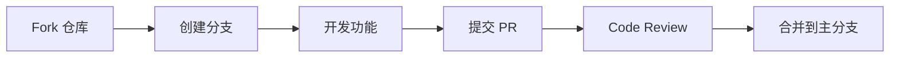

# 第16章：社区生态与贡献

> 参与 OpenClaw 开源社区，贡献代码与技能

---

## 16.1 社区资源

### 官方渠道

| 平台 | 链接 | 用途 |
|------|------|------|
| GitHub | https://github.com/openclaw/openclaw | 代码仓库、Issue |
| 官方文档 | https://docs.openclaw.io | 完整文档 |
| Discord | https://discord.gg/openclaw | 英文社区讨论 |
| 论坛 | https://forum.openclaw.io | 技术问答 |
| Twitter | @OpenClawAI | 官方动态 |

### 中文社区

- **飞书群**：扫描官方文档中的二维码加入
- **微信群**：添加小助手微信入群
- **知乎专栏**：OpenClaw 技术专栏
- **B站**：官方视频教程

---

## 16.2 Skill 市场

### 浏览与安装

```bash
# 列出所有可用 Skills
openclaw skill search

# 按分类搜索
openclaw skill search --category productivity

# 安装 Skill
openclaw skill install weather-query

# 查看已安装
openclaw skill list

# 更新 Skill
openclaw skill update weather-query

# 卸载 Skill
openclaw skill uninstall weather-query
```

### 热门 Skill 推荐

| Skill | 功能 | 下载量 |
|-------|------|--------|
| weather-query | 天气查询 | 50k+ |
| email-sender | 邮件发送 | 30k+ |
| calendar | 日历管理 | 25k+ |
| notion-sync | Notion 同步 | 20k+ |
| github-webhook | GitHub 集成 | 18k+ |
| jira-connector | Jira 集成 | 15k+ |

---

## 16.3 贡献指南

### 代码贡献流程



**具体步骤**：

```bash
# 1. Fork 仓库到个人账号
# 在 GitHub 上点击 Fork 按钮

# 2. 克隆个人仓库
git clone https://github.com/YOUR_USERNAME/openclaw.git
cd openclaw

# 3. 添加上游仓库
git remote add upstream https://github.com/openclaw/openclaw.git

# 4. 创建功能分支
git checkout -b feature/your-feature-name

# 5. 开发并提交
git add .
git commit -m "feat: add new feature"

# 6. 保持与上游同步
git fetch upstream
git rebase upstream/main

# 7. 推送到个人仓库
git push origin feature/your-feature-name

# 8. 在 GitHub 创建 Pull Request
```

### 提交规范

**Commit Message 格式**：

```
<type>(<scope>): <subject>

<body>

<footer>
```

**Type 类型**：

| 类型 | 说明 |
|------|------|
| feat | 新功能 |
| fix | Bug 修复 |
| docs | 文档更新 |
| style | 代码格式（不影响功能） |
| refactor | 重构 |
| perf | 性能优化 |
| test | 测试相关 |
| chore | 构建/工具相关 |

**示例**：

```
feat(channel): add Discord voice channel support

- Support voice message receiving
- Support voice message sending
- Add voice-to-text conversion

Closes #123
```

### Skill 贡献

```bash
# 1. 开发 Skill（参考第8章）
# 2. 测试确保质量
pytest

# 3. 打包
openclaw skill build

# 4. 提交到 Registry
openclaw skill publish

# 或手动提交 PR 到 skill-registry 仓库
```

**Skill 提交要求**：

- [ ] 完整的 manifest.yaml
- [ ] README 文档
- [ ] 单元测试覆盖 > 80%
- [ ] 无安全漏洞
- [ ] 遵循代码规范

---

## 16.4 问题反馈

### Bug 报告

使用 GitHub Issue 模板：

```markdown
## Bug 描述
清晰描述 Bug 现象

## 复现步骤
1. 步骤1
2. 步骤2
3. 步骤3

## 期望行为
描述期望的正确行为

## 实际行为
描述实际的错误行为

## 环境信息
- OpenClaw 版本：v1.2.3
- 部署方式：Docker
- 操作系统：Ubuntu 22.04
- 浏览器：Chrome 120

## 日志
```
粘贴相关日志
```

## 截图
如有必要，添加截图
```

### 功能建议

```markdown
## 功能描述
描述你希望添加的功能

## 使用场景
描述这个功能的使用场景

## 期望方案
描述你期望的实现方案

## 替代方案
描述你考虑过的替代方案

## 附加信息
其他相关信息
```

---

## 16.5 版本更新

### 版本号规则

OpenClaw 使用语义化版本（SemVer）：

```
主版本号.次版本号.修订号
例如：1.2.3
```

| 版本变化 | 说明 | 示例 |
|----------|------|------|
| 主版本号 | 不兼容的 API 修改 | 1.x.x → 2.0.0 |
| 次版本号 | 向下兼容的功能新增 | 1.2.x → 1.3.0 |
| 修订号 | 向下兼容的问题修复 | 1.2.3 → 1.2.4 |

### 升级策略

```bash
# 查看当前版本
openclaw version

# 检查更新
openclaw update check

# 升级到最新版
openclaw update

# 升级到指定版本
openclaw update --version 1.3.0
```

### 数据库迁移

```bash
# 自动迁移
docker-compose run --rm openclaw migrate

# 查看迁移状态
openclaw migrate status

# 回滚到上一版本
openclaw migrate rollback
```

---

## 16.6 本章小结

本章介绍了 OpenClaw 社区生态：

1. **社区资源**：GitHub、Discord、论坛等官方渠道
2. **Skill 市场**：浏览、安装、管理 Skills
3. **贡献指南**：代码贡献流程、提交规范
4. **问题反馈**：Bug 报告、功能建议模板
5. **版本更新**：版本号规则、升级策略

**参与方式**：
- ⭐ Star 项目表示支持
- 🐛 提交 Bug 报告
- 💡 提出功能建议
- 📝 改进文档
- 🔧 提交代码 PR
- 🎁 分享你的 Skill

