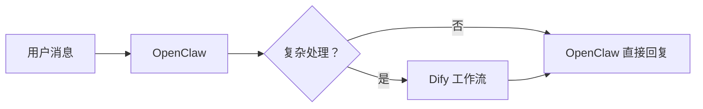
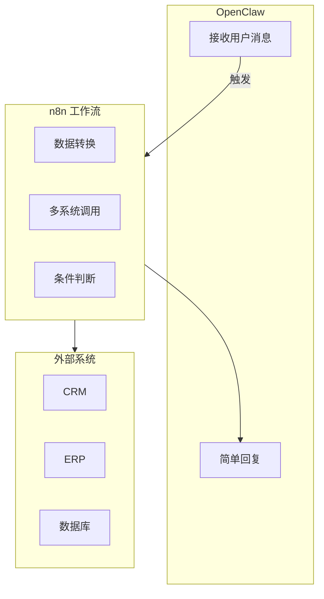

# 第17章：与其他工具集成

> OpenClaw 与 Dify、n8n、Zapier、Home Assistant 等工具的集成方案

---

## 17.1 与 Dify 集成

### 集成场景

Dify 擅长构建 AI 应用，OpenClaw 擅长多渠道部署，两者可以互补：



### API 调用集成

```yaml
# 在 OpenClaw 中配置 Dify API
integrations:
  dify:
    base_url: "https://api.dify.ai/v1"
    api_key: "${DIFY_API_KEY}"
    app_id: "your-app-id"
```

```python
# skills/dify_integration/dify_integration.py
import requests
from typing import Dict, Any

class DifyIntegration:
    def __init__(self, config: Dict):
        self.base_url = config["base_url"]
        self.api_key = config["api_key"]
    
    async def chat(self, message: str, user_id: str) -> Dict[str, Any]:
        """调用 Dify Chat API"""
        
        url = f"{self.base_url}/chat-messages"
        
        headers = {
            "Authorization": f"Bearer {self.api_key}",
            "Content-Type": "application/json"
        }
        
        payload = {
            "inputs": {},
            "query": message,
            "response_mode": "blocking",
            "conversation_id": "",
            "user": user_id
        }
        
        response = requests.post(url, headers=headers, json=payload)
        return response.json()
    
    async def workflow(self, inputs: Dict, user_id: str) -> Dict[str, Any]:
        """调用 Dify 工作流"""
        
        url = f"{self.base_url}/workflows/run"
        
        headers = {
            "Authorization": f"Bearer {self.api_key}",
            "Content-Type": "application/json"
        }
        
        payload = {
            "inputs": inputs,
            "response_mode": "blocking",
            "user": user_id
        }
        
        response = requests.post(url, headers=headers, json=payload)
        return response.json()
```

### Webhook 双向集成

```yaml
# OpenClaw 接收 Dify 回调
webhooks:
  - path: /webhooks/dify
    handler: handle_dify_callback
    
# Dify 配置 OpenClaw 回调
# 在 Dify 应用设置中配置 Webhook URL
```

---

## 17.2 与 n8n 集成

### 集成方案

n8n 是强大的工作流自动化工具，与 OpenClaw 结合可实现复杂业务逻辑：



### OpenClaw Trigger for n8n

```python
# n8n 自定义节点
class OpenClawTrigger:
    def __init__(self):
        self.description = {
            "displayName": "OpenClaw Trigger",
            "name": "openclawTrigger",
            "group": ["trigger"],
            "version": 1,
            "description": "Triggers when OpenClaw receives a message",
            "defaults": {
                "name": "OpenClaw Trigger"
            },
            "inputs": [],
            "outputs": ["main"],
            "properties": [
                {
                    "displayName": "Webhook URL",
                    "name": "webhookUrl",
                    "type": "string",
                    "default": "",
                    "required": True
                }
            ]
        }
    
    async def trigger(self):
        # 返回触发数据
        return {
            "message": self.getMessage(),
            "user": self.getUser(),
            "channel": self.getChannel()
        }
```

### n8n Webhook 调用 OpenClaw

```javascript
// n8n HTTP Request 节点配置
{
  "method": "POST",
  "url": "https://your-openclaw.com/api/webhooks/n8n",
  "headers": {
    "Authorization": "Bearer {{$credentials.openclawApiKey}}",
    "Content-Type": "application/json"
  },
  "body": {
    "channel": "{{$json.channel}}",
    "user_id": "{{$json.user.id}}",
    "message": "{{$json.message}}"
  }
}
```

---

## 17.3 与 Zapier/Make 集成

### Zapier 集成

通过 Webhook 实现与 5000+ 应用的连接：

```yaml
# OpenClaw 配置 Zapier Webhook
integrations:
  zapier:
    triggers:
      - name: "new_message"
        webhook_url: "${ZAPIER_WEBHOOK_URL}"
        events: ["message.received"]
      
      - name: "ticket_created"
        webhook_url: "${ZAPIER_WEBHOOK_URL_2}"
        events: ["ticket.created"]
```

### Make (Integromat) 集成

```python
# 调用 Make Webhook
async def trigger_make_scenario(self, data: Dict):
    """触发 Make 场景"""
    
    webhook_url = "https://hook.make.com/xxxxxx"
    
    async with aiohttp.ClientSession() as session:
        async with session.post(webhook_url, json=data) as response:
            return await response.json()
```

---

## 17.4 与 Home Assistant 集成

### 智能家居控制

```python
# skills/home_assistant/home_assistant.py
import aiohttp
from typing import Dict, Any

class HomeAssistantSkill:
    def __init__(self, config: Dict):
        self.base_url = config["base_url"]
        self.token = config["long_lived_token"]
    
    async def call_service(
        self,
        domain: str,
        service: str,
        service_data: Dict = None
    ) -> Dict[str, Any]:
        """调用 Home Assistant 服务"""
        
        url = f"{self.base_url}/api/services/{domain}/{service}"
        
        headers = {
            "Authorization": f"Bearer {self.token}",
            "Content-Type": "application/json"
        }
        
        async with aiohttp.ClientSession() as session:
            async with session.post(
                url,
                headers=headers,
                json=service_data or {}
            ) as response:
                return await response.json()
    
    async def get_states(self) -> Dict[str, Any]:
        """获取所有实体状态"""
        
        url = f"{self.base_url}/api/states"
        
        headers = {
            "Authorization": f"Bearer {self.token}"
        }
        
        async with aiohttp.ClientSession() as session:
            async with session.get(url, headers=headers) as response:
                return await response.json()
    
    # 快捷操作
    async def turn_on_light(self, entity_id: str):
        """开灯"""
        return await self.call_service(
            "light", "turn_on",
            {"entity_id": entity_id}
        )
    
    async def turn_off_light(self, entity_id: str):
        """关灯"""
        return await self.call_service(
            "light", "turn_off",
            {"entity_id": entity_id}
        )
    
    async def set_temperature(self, entity_id: str, temperature: float):
        """设置温度"""
        return await self.call_service(
            "climate", "set_temperature",
            {
                "entity_id": entity_id,
                "temperature": temperature
            }
        )
```

### 自然语言控制

```yaml
# Agent 配置示例
agent:
  system_prompt: |
    你是智能家居助手，可以通过 Home Assistant 控制家中设备。
    
    可用设备：
    - 客厅灯：light.living_room
    - 卧室灯：light.bedroom
    - 空调：climate.bedroom_ac
    - 窗帘：cover.living_room_curtain
    
    当用户要求控制设备时，使用相应的工具。
```

---

## 17.5 自定义集成

### Webhook 集成模板

```python
# 通用 Webhook 集成基类
from abc import ABC, abstractmethod
from typing import Dict, Any

class WebhookIntegration(ABC):
    def __init__(self, config: Dict):
        self.config = config
    
    @abstractmethod
    async def send(self, data: Dict) -> Dict[str, Any]:
        """发送数据到外部系统"""
        pass
    
    @abstractmethod
    async def receive(self, request: Dict) -> Dict[str, Any]:
        """接收外部系统数据"""
        pass
    
    def validate_signature(self, payload: str, signature: str) -> bool:
        """验证 Webhook 签名"""
        import hmac
        import hashlib
        
        secret = self.config.get("webhook_secret", "")
        computed = hmac.new(
            secret.encode(),
            payload.encode(),
            hashlib.sha256
        ).hexdigest()
        
        return hmac.compare_digest(computed, signature)
```

### 数据库直连

```python
# 直接连接业务数据库
import asyncpg

class DatabaseIntegration:
    def __init__(self, dsn: str):
        self.dsn = dsn
        self.pool = None
    
    async def connect(self):
        """建立连接池"""
        self.pool = await asyncpg.create_pool(self.dsn)
    
    async def query_user_orders(self, user_id: str):
        """查询用户订单"""
        async with self.pool.acquire() as conn:
            rows = await conn.fetch(
                "SELECT * FROM orders WHERE user_id = $1 ORDER BY created_at DESC",
                user_id
            )
            return [dict(row) for row in rows]
```

---

## 17.6 本章小结

本章讲解了 OpenClaw 与其他工具的集成方案：

1. **Dify**：API 调用、Webhook 双向集成
2. **n8n**：Trigger 节点、HTTP 调用
3. **Zapier/Make**：Webhook 触发 5000+ 应用
4. **Home Assistant**：智能家居控制
5. **自定义集成**：Webhook 基类、数据库直连

**集成原则**：
- 选择合适的工具处理合适的任务
- 使用 Webhook 实现实时通信
- 使用 API 调用实现复杂交互
- 做好错误处理和重试机制

