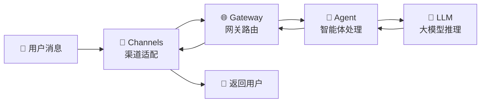
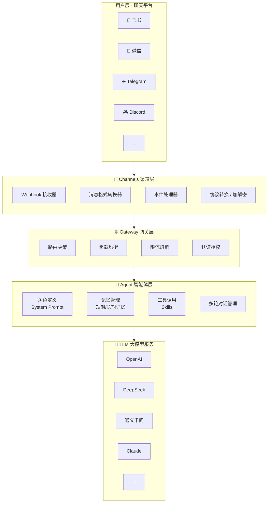
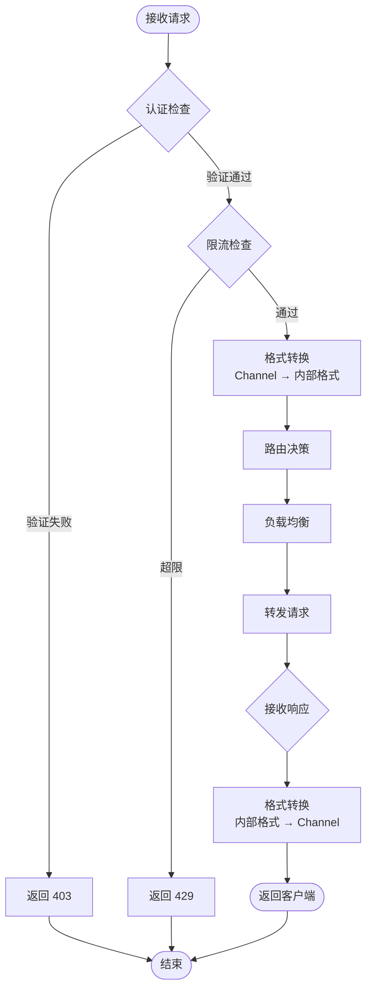
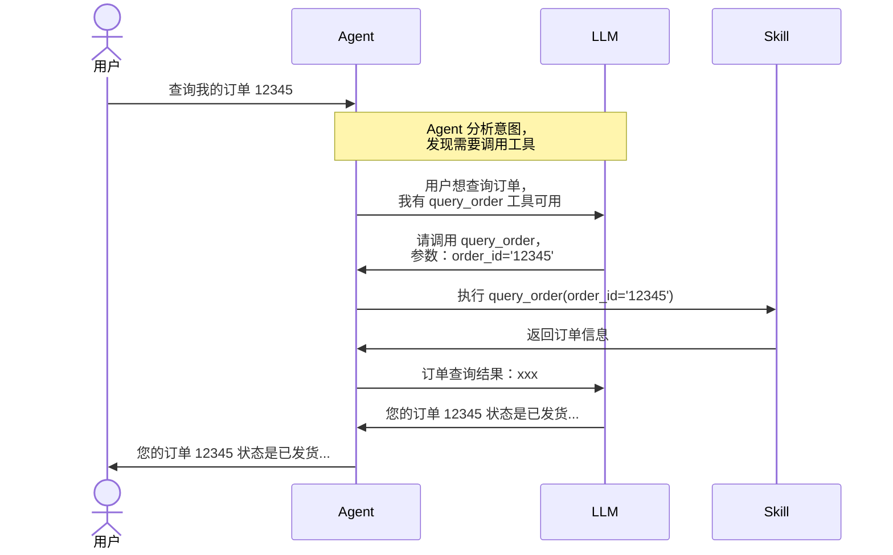
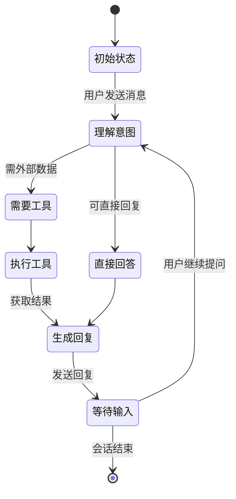
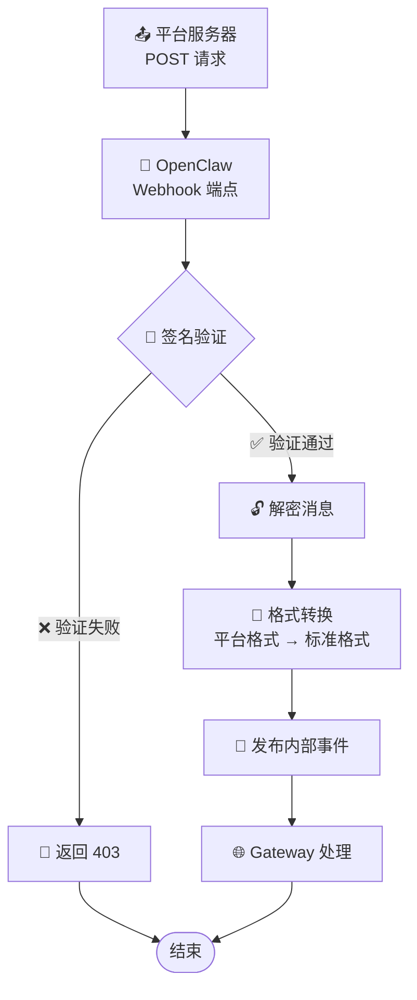
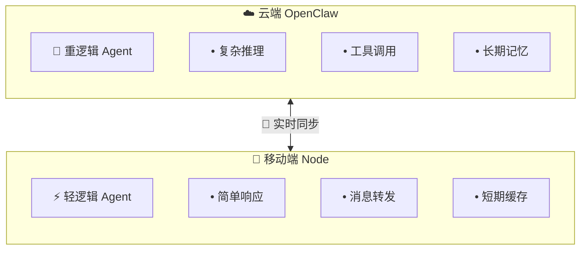
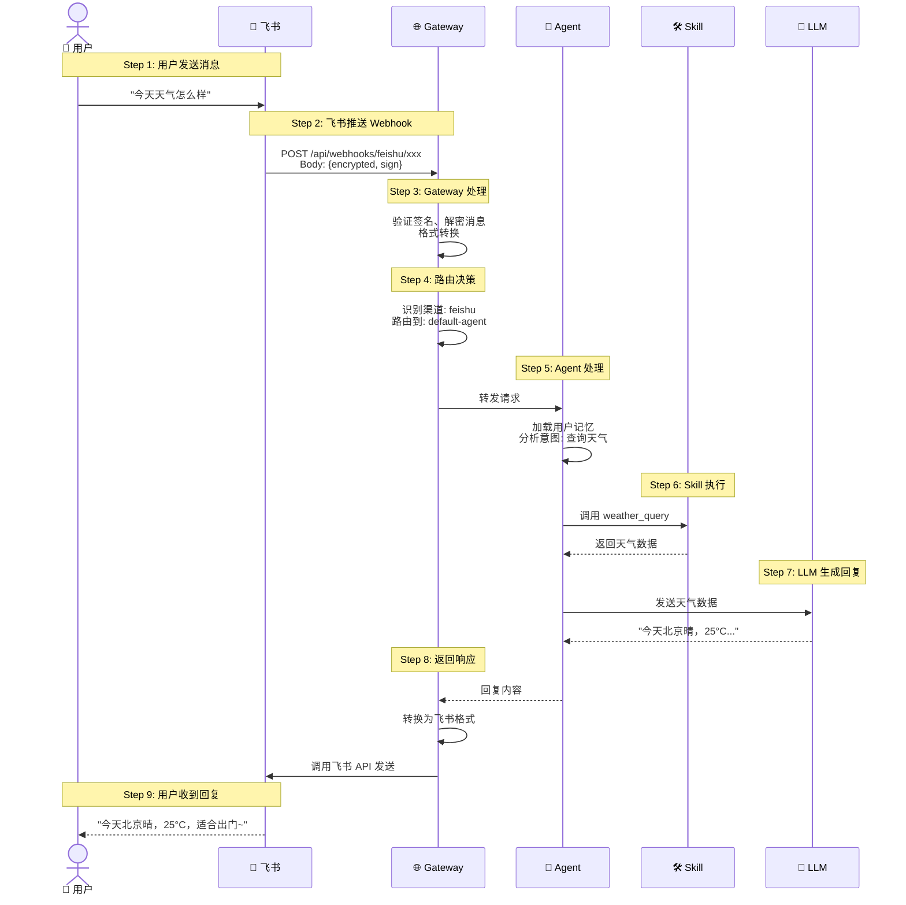

# 第4章：核心概念详解

> 深入理解 Gateway、Agent、Channels、Nodes 四大核心组件

---

## 4.1 架构全景图

在深入各个组件之前，让我们先建立整体认知。OpenClaw 采用分层架构，数据流向如下：





---

## 4.2 Gateway（网关）

Gateway 是整个系统的入口和交通指挥中心。

### 核心职责

**1. 请求路由**

根据消息的渠道、用户、内容等特征，将请求路由到正确的 Agent：

```yaml
# 路由配置示例
routing:
  rules:
    # 按渠道路由
    - condition: "channel.type == 'feishu'"
      target: "enterprise-agent"
    
    # 按用户路由
    - condition: "user.group == 'vip'"
      target: "vip-agent"
    
    # 按内容路由
    - condition: "message.contains('投诉')"
      target: "complaint-agent"
    
    # 默认路由
    - condition: "default"
      target: "default-agent"
```

**2. 负载均衡**

当部署多个 Agent 实例时，Gateway 负责分发请求：

```yaml
# 负载均衡配置
load_balancer:
  strategy: round_robin  # 轮询，可选：random, least_connections, ip_hash
  health_check:
    interval: 30s
    timeout: 5s
    unhealthy_threshold: 3
```

**3. 限流熔断**

防止突发流量或下游故障影响整个系统：

```yaml
# 限流配置
rate_limit:
  # 全局限流：每秒最多 1000 个请求
  global:
    requests_per_second: 1000
    burst: 2000
  
  # 按用户限流：每个用户每秒最多 10 个请求
  per_user:
    requests_per_second: 10
    burst: 20

# 熔断配置
circuit_breaker:
  failure_threshold: 5       # 连续失败 5 次后熔断
  recovery_timeout: 30s      # 熔断 30 秒后尝试恢复
  half_open_max_calls: 3     # 半开状态下最多允许 3 个试探请求
```

**4. 认证授权**

验证请求的合法性：

```yaml
# 认证配置
auth:
  # JWT 认证
  jwt:
    secret: "${JWT_SECRET}"
    expires_in: 24h
  
  # Webhook 签名验证
  webhook:
    feishu:
      verification_token: "${FEISHU_VERIFICATION_TOKEN}"
    dingtalk:
      app_secret: "${DINGTALK_APP_SECRET}"
```

### Gateway 工作流程



---

## 4.3 Agent（智能体）

Agent 是 OpenClaw 的"大脑"，负责与 LLM 交互并维护对话状态。

### 角色定义（System Prompt）

System Prompt 定义了 Agent 的身份、能力和行为边界。

**示例：技术支持 Agent**

```yaml
agent:
  name: "技术支持助手"
  system_prompt: |
    你是 Acme 公司的技术支持助手，专门帮助用户解决产品使用问题。
    
    ## 身份设定
    - 姓名：小 A
    - 性格：耐心、专业、友好
    - 语言：中文为主，可根据用户切换
    
    ## 能力范围
    - 解答产品功能相关问题
    - 指导常见故障排查
    - 收集用户反馈并记录
    - 无法解决时转接人工客服
    
    ## 行为规范
    1. 首次回复必须问候用户并询问具体问题
    2. 解答时分步骤说明，必要时使用编号列表
    3. 涉及操作步骤时，提供截图指引（使用 Markdown 图片语法）
    4. 遇到复杂问题，主动询问用户是否方便电话沟通
    5. 每次回复末尾添加："如果问题未解决，请回复'转人工'"
    
    ## 限制
    - 不讨论竞争对手产品
    - 不透露内部技术细节
    - 不承诺具体修复时间
    
    ## 工具使用
    当需要查询用户订单或创建工单时，使用相应工具。
```

### 记忆管理

Agent 的记忆分为两个层次：

**1. 短期记忆（上下文窗口）**

维护当前对话的历史消息，直接发送给 LLM：

```yaml
memory:
  short_term:
    max_messages: 20        # 保留最近 20 条消息
    max_tokens: 4000        # 上下文 Token 上限
    strategy: sliding_window # 滑动窗口，超出时丢弃最早的消息
```

⚠️ **注意**：上下文窗口越大，API 调用成本越高，响应速度越慢。

**2. 长期记忆（向量数据库）**

存储跨会话的知识和用户信息：

```yaml
memory:
  long_term:
    enabled: true
    vector_store: chroma    # 可选：chroma, milvus, pinecone
    embedding_model: text-embedding-3-small
    
    # 自动记忆规则
    auto_memorize:
      user_preferences: true    # 记住用户偏好
      important_facts: true     # 记住重要事实
      conversation_summary: true # 对话结束后生成摘要
```

**记忆检索示例**：

```python
# 当用户提问时，Agent 会自动检索相关记忆
user_query = "我上周问过的那个问题"

# 检索过程
relevant_memories = vector_store.similarity_search(
    query=user_query,
    filter={"user_id": current_user.id},
    top_k=5
)

# 将检索结果注入 Prompt
augmented_prompt = f"""
以下是可能与用户问题相关的历史信息：
{relevant_memories}

用户当前问题：{user_query}
"""
```

### 工具调用（Function Calling）

Agent 可以通过调用外部工具（Skill）扩展能力。

**工具定义示例**：

```yaml
tools:
  - name: "query_order"
    description: "查询用户订单信息"
    parameters:
      type: object
      properties:
        order_id:
          type: string
          description: "订单号"
        phone:
          type: string
          description: "下单手机号（后四位）"
      required: ["order_id"]
  
  - name: "create_ticket"
    description: "创建售后工单"
    parameters:
      type: object
      properties:
        issue_type:
          type: string
          enum: ["退款", "换货", "维修", "投诉"]
        description:
          type: string
          description: "问题描述"
      required: ["issue_type", "description"]
```

**工具调用流程**：



### 多轮对话管理

**对话状态机**：



**上下文压缩策略**：

当对话历史过长时，Agent 会采用以下策略压缩：

```yaml
context_compression:
  # 策略1：摘要替换
  summarization:
    trigger: token_count > 3000
    method: "将早期对话摘要为一段文字"
  
  # 策略2：关键信息提取
  key_info_extraction:
    trigger: token_count > 3500
    method: "提取用户偏好、重要事实，丢弃闲聊内容"
  
  # 策略3：遗忘旧消息
  message_dropping:
    trigger: token_count > 3800
    method: "保留最近 N 条，丢弃更早的消息"
```

---

## 4.4 Channels（渠道）

Channels 层负责对接各类聊天平台，处理协议差异。

### 平台适配器架构

每个平台都有独立的适配器，统一实现以下接口：

```typescript
interface ChannelAdapter {
  // 接收消息
  onMessage(callback: (message: Message) => void): void;
  
  // 发送消息
  sendMessage(channelId: string, content: MessageContent): Promise<void>;
  
  // 发送富媒体
  sendMedia(channelId: string, media: MediaContent): Promise<void>;
  
  // 验证 Webhook 签名
  verifyWebhook(request: WebhookRequest): boolean;
  
  // 格式转换：平台格式 → 标准格式
  parseIncoming(data: any): Message;
  
  // 格式转换：标准格式 → 平台格式
  formatOutgoing(content: MessageContent): any;
}
```

### 消息格式标准化

OpenClaw 内部使用统一的消息格式，各平台适配器负责转换：

```typescript
// 内部标准消息格式
interface Message {
  id: string;                    // 消息唯一ID
  channel: {
    type: 'feishu' | 'wechat' | 'telegram' | ...;
    id: string;                  // 渠道实例ID
  };
  sender: {
    id: string;                  // 用户ID
    name: string;                // 用户昵称
    avatar?: string;             // 头像URL
  };
  conversation: {
    id: string;                  // 会话ID（群聊/私聊）
    type: 'private' | 'group';
    name?: string;               // 群聊名称
  };
  content: {
    type: 'text' | 'image' | 'file' | 'voice' | ...;
    text?: string;               // 文本内容
    mediaUrl?: string;           // 媒体文件URL
    fileName?: string;           // 文件名
    metadata?: any;              // 平台特定数据
  };
  timestamp: number;             // 发送时间戳
  replyTo?: string;              // 回复的消息ID
}
```

### Webhook 处理流程



### 消息加解密

微信、飞书等平台要求消息加密传输：

**飞书消息解密示例**：

```python
import base64
import json
from cryptography.hazmat.primitives.ciphers import Cipher, algorithms, modes

def decrypt_feishu_message(encrypt_key: str, encrypt_data: str) -> dict:
    """解密飞书加密消息"""
    # 1. Base64 解码密钥
    key = base64.b64decode(encrypt_key + '=' * (4 - len(encrypt_key) % 4))
    
    # 2. Base64 解码密文
    ciphertext = base64.b64decode(encrypt_data)
    
    # 3. AES-256-CBC 解密
    iv = ciphertext[:16]
    cipher = Cipher(algorithms.AES(key), modes.CBC(iv))
    decryptor = cipher.decryptor()
    plaintext = decryptor.update(ciphertext[16:]) + decryptor.finalize()
    
    # 4. 去除填充
    padding_len = plaintext[-1]
    plaintext = plaintext[:-padding_len]
    
    # 5. JSON 解析
    return json.loads(plaintext.decode('utf-8'))
```

---

## 4.5 Nodes（移动端节点）

Nodes 是可选组件，用于在移动端或边缘设备上部署轻量级 Agent。

### 使用场景

**1. 移动端部署**

在手机或平板上运行轻量级 Agent，实现：
- 离线消息缓存
- 本地数据处理
- 隐私敏感操作（数据不上云）

**2. 边缘计算**

在边缘服务器上部署，实现：
- 降低延迟
- 减少带宽
- 本地数据合规

### 架构特点



### 同步机制

```yaml
node:
  sync:
    # 实时同步（WebSocket）
    realtime:
      enabled: true
      heartbeat_interval: 30s
    
    # 离线消息队列
    offline_queue:
      max_size: 1000
      ttl: 7d
    
    # 数据同步策略
    data_sync:
      user_profile: realtime      # 实时同步
      conversation_history: hourly # 每小时同步
      knowledge_base: daily       # 每天同步
```

---

## 4.6 数据流转完整示例

让我们通过一个完整示例，理解各组件如何协作：

**场景**：用户在飞书上问"今天天气怎么样"



---

## 4.7 本章小结

本章深入讲解了 OpenClaw 的四大核心组件：

| 组件 | 核心职责 | 关键技术 |
|------|----------|----------|
| **Gateway** | 请求路由、负载均衡、限流熔断 | 反向代理、一致性哈希、令牌桶算法 |
| **Agent** | 对话管理、记忆维护、工具调用 | Prompt 工程、RAG、Function Calling |
| **Channels** | 平台适配、消息转换、Webhook 处理 | 协议适配、加解密、格式标准化 |
| **Nodes** | 移动端部署、离线能力、边缘计算 | 数据同步、消息队列、本地缓存 |

理解这些核心概念后，下一章我们将实战接入各种聊天渠道。

---

## 思考题

1. 如果你要设计一个同时服务普通用户和 VIP 用户的系统，Gateway 的路由规则应该如何设计？
2. Agent 的短期记忆和长期记忆各有什么优缺点？什么信息应该存到长期记忆中？
3. 为什么 Channels 层需要统一消息格式？直接透传原始消息有什么问题？
