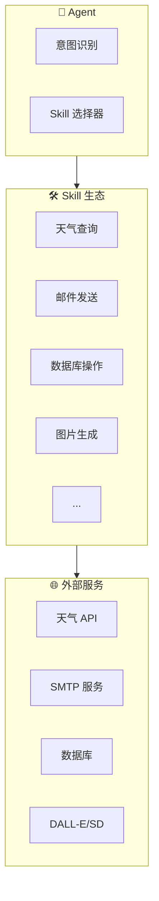
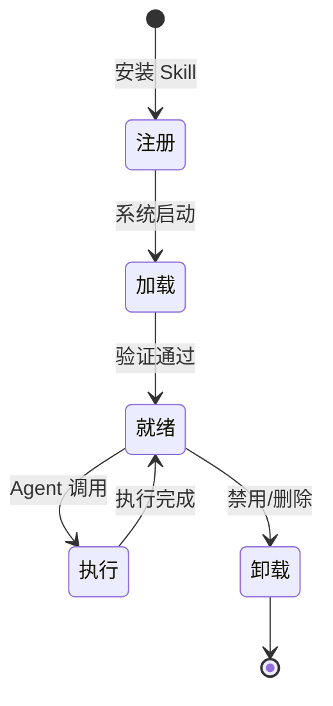

# 第8章：Skill 开发实战

> 开发自定义技能，扩展 OpenClaw 的能力边界

---

## 8.1 Skill 架构概览

### 什么是 Skill

Skill（技能）是 OpenClaw 的插件系统，用于扩展 Agent 的能力。每个 Skill 是一个独立的功能模块，可以被 Agent 动态调用。



### Skill 的组成

一个完整的 Skill 包含以下部分：

```
skill-name/
├── manifest.yaml      # Skill 元数据定义
├── __init__.py        # 入口文件
├── main.py            # 主逻辑
├── requirements.txt   # 依赖
├── config.yaml        # 配置文件
└── tests/             # 测试
    └── test_main.py
```

### Skill 生命周期



---

## 8.2 Skill 开发环境搭建

### 开发工具准备

```bash
# 1. 创建开发目录
mkdir -p ~/openclaw-skills
cd ~/openclaw-skills

# 2. 创建虚拟环境
python -m venv venv
source venv/bin/activate  # Linux/Mac
# 或 venv\Scripts\activate  # Windows

# 3. 安装 OpenClaw SDK
pip install openclaw-sdk

# 4. 安装开发工具
pip install pytest black flake8 mypy
```

### 创建第一个 Skill

使用 CLI 工具快速创建 Skill 模板：

```bash
# 创建 Skill 模板
openclaw skill create weather-query

# 进入目录
cd weather-query

# 查看结构
tree
```

生成的目录结构：

```
weather-query/
├── manifest.yaml
├── __init__.py
├── main.py
├── requirements.txt
└── README.md
```

### manifest.yaml 详解

```yaml
# manifest.yaml - Skill 元数据定义
skill:
  # 基本信息
  name: weather-query
  version: 1.0.0
  description: 查询全球城市天气信息
  author: your-name
  license: MIT
  
  # 分类标签
  tags:
    - weather
    - utility
    - api
  
  # 工具定义（Function Calling）
  tools:
    - name: get_current_weather
      description: 获取指定城市当前天气
      parameters:
        type: object
        properties:
          city:
            type: string
            description: 城市名称，如"北京"、"Shanghai"
          country:
            type: string
            description: 国家代码，如"CN"、"US"
        required: [city]
    
    - name: get_forecast
      description: 获取未来几天天气预报
      parameters:
        type: object
        properties:
          city:
            type: string
            description: 城市名称
          days:
            type: integer
            description: 预报天数（1-7）
            default: 3
        required: [city]
  
  # 配置项
  config:
    - name: api_key
      type: string
      required: true
      description: 天气 API Key
      secret: true
    
    - name: default_city
      type: string
      required: false
      default: "北京"
      description: 默认城市
  
  # 依赖
  dependencies:
    python: ">=3.9"
    packages:
      - requests>=2.28.0
      - pydantic>=2.0.0
  
  # 权限声明
  permissions:
    - network
    - filesystem
```

---

## 8.3 Skill 开发实战

### 实战一：天气查询 Skill

**main.py 实现**：

```python
# weather-query/main.py
import requests
from typing import Dict, Any, Optional
from pydantic import BaseModel, Field

# 配置模型
class WeatherConfig(BaseModel):
    api_key: str
    default_city: str = "北京"
    base_url: str = "https://api.weatherapi.com/v1"

# Skill 主类
class WeatherSkill:
    def __init__(self, config: Dict[str, Any]):
        self.config = WeatherConfig(**config)
    
    async def get_current_weather(
        self,
        city: str,
        country: Optional[str] = None
    ) -> Dict[str, Any]:
        """获取当前天气"""
        
        # 构建查询参数
        location = f"{city},{country}" if country else city
        
        url = f"{self.config.base_url}/current.json"
        params = {
            "key": self.config.api_key,
            "q": location,
            "lang": "zh"
        }
        
        try:
            response = requests.get(url, params=params, timeout=10)
            response.raise_for_status()
            data = response.json()
            
            # 格式化返回结果
            current = data["current"]
            location_data = data["location"]
            
            return {
                "success": True,
                "city": location_data["name"],
                "country": location_data["country"],
                "temperature_c": current["temp_c"],
                "temperature_f": current["temp_f"],
                "condition": current["condition"]["text"],
                "humidity": current["humidity"],
                "wind_kph": current["wind_kph"],
                "feels_like_c": current["feelslike_c"],
                "last_updated": current["last_updated"],
                "icon": current["condition"]["icon"]
            }
        
        except requests.exceptions.RequestException as e:
            return {
                "success": False,
                "error": f"请求失败: {str(e)}"
            }
    
    async def get_forecast(
        self,
        city: str,
        days: int = 3
    ) -> Dict[str, Any]:
        """获取天气预报"""
        
        url = f"{self.config.base_url}/forecast.json"
        params = {
            "key": self.config.api_key,
            "q": city,
            "days": min(days, 7),  # 限制最大7天
            "lang": "zh"
        }
        
        try:
            response = requests.get(url, params=params, timeout=10)
            response.raise_for_status()
            data = response.json()
            
            forecast_days = data["forecast"]["forecastday"]
            
            forecasts = []
            for day in forecast_days:
                day_data = day["day"]
                forecasts.append({
                    "date": day["date"],
                    "max_temp_c": day_data["maxtemp_c"],
                    "min_temp_c": day_data["mintemp_c"],
                    "condition": day_data["condition"]["text"],
                    "chance_of_rain": day_data["daily_chance_of_rain"]
                })
            
            return {
                "success": True,
                "city": data["location"]["name"],
                "forecasts": forecasts
            }
        
        except requests.exceptions.RequestException as e:
            return {
                "success": False,
                "error": f"请求失败: {str(e)}"
            }

# 导出 Skill 实例
skill = WeatherSkill
```

**__init__.py 入口**：

```python
# weather-query/__init__.py
from .main import WeatherSkill, skill

__all__ = ["WeatherSkill", "skill"]
```

### 实战二：邮件发送 Skill

```python
# email-sender/main.py
import smtplib
from email.mime.text import MIMEText
from email.mime.multipart import MIMEMultipart
from email.mime.base import MIMEBase
from email import encoders
from typing import List, Optional, Dict, Any
from pydantic import BaseModel, EmailStr
import os

class EmailConfig(BaseModel):
    smtp_host: str
    smtp_port: int = 587
    username: str
    password: str
    use_tls: bool = True
    default_from: Optional[str] = None

class EmailSkill:
    def __init__(self, config: Dict[str, Any]):
        self.config = EmailConfig(**config)
    
    async def send_email(
        self,
        to: str,
        subject: str,
        content: str,
        content_type: str = "plain",
        cc: Optional[List[str]] = None,
        bcc: Optional[List[str]] = None,
        attachments: Optional[List[str]] = None
    ) -> Dict[str, Any]:
        """发送邮件"""
        
        try:
            # 创建邮件对象
            msg = MIMEMultipart()
            msg["From"] = self.config.default_from or self.config.username
            msg["To"] = to
            msg["Subject"] = subject
            
            if cc:
                msg["Cc"] = ", ".join(cc)
            
            # 添加正文
            if content_type == "html":
                msg.attach(MIMEText(content, "html", "utf-8"))
            else:
                msg.attach(MIMEText(content, "plain", "utf-8"))
            
            # 添加附件
            if attachments:
                for file_path in attachments:
                    if os.path.exists(file_path):
                        with open(file_path, "rb") as f:
                            part = MIMEBase("application", "octet-stream")
                            part.set_payload(f.read())
                        
                        encoders.encode_base64(part)
                        filename = os.path.basename(file_path)
                        part.add_header(
                            "Content-Disposition",
                            f"attachment; filename= {filename}"
                        )
                        msg.attach(part)
            
            # 连接 SMTP 服务器
            server = smtplib.SMTP(self.config.smtp_host, self.config.smtp_port)
            
            if self.config.use_tls:
                server.starttls()
            
            server.login(self.config.username, self.config.password)
            
            # 发送邮件
            recipients = [to]
            if cc:
                recipients.extend(cc)
            if bcc:
                recipients.extend(bcc)
            
            server.sendmail(
                self.config.username,
                recipients,
                msg.as_string()
            )
            
            server.quit()
            
            return {
                "success": True,
                "message": f"邮件已发送至 {to}"
            }
        
        except Exception as e:
            return {
                "success": False,
                "error": f"发送失败: {str(e)}"
            }
    
    async def send_template_email(
        self,
        to: str,
        template_name: str,
        template_data: Dict[str, Any],
        subject: Optional[str] = None
    ) -> Dict[str, Any]:
        """发送模板邮件"""
        
        # 加载模板
        templates = {
            "welcome": {
                "subject": "欢迎加入 {company}",
                "body": """您好 {name}，

欢迎加入 {company}！

您的账号已创建成功，请使用以下信息登录：
用户名：{username}
初始密码：{password}

请尽快修改密码。

此致
{company} 团队
"""
            },
            "notification": {
                "subject": "{title}",
                "body": """{content}

---
此邮件由系统自动发送，请勿回复。
"""
            }
        }
        
        template = templates.get(template_name)
        if not template:
            return {
                "success": False,
                "error": f"模板 {template_name} 不存在"
            }
        
        # 渲染模板
        email_subject = subject or template["subject"].format(**template_data)
        email_body = template["body"].format(**template_data)
        
        return await self.send_email(
            to=to,
            subject=email_subject,
            content=email_body
        )

skill = EmailSkill
```

### 实战三：数据库操作 Skill

```python
# database-connector/main.py
from typing import Dict, Any, List, Optional
from pydantic import BaseModel
import asyncio

class DatabaseConfig(BaseModel):
    db_type: str  # mysql, postgresql, sqlite
    host: Optional[str] = None
    port: Optional[int] = None
    database: str
    username: Optional[str] = None
    password: Optional[str] = None

class DatabaseSkill:
    def __init__(self, config: Dict[str, Any]):
        self.config = DatabaseConfig(**config)
        self.connection = None
    
    async def _get_connection(self):
        """获取数据库连接"""
        if self.config.db_type == "sqlite":
            import aiosqlite
            return await aiosqlite.connect(self.config.database)
        
        elif self.config.db_type == "mysql":
            import aiomysql
            return await aiomysql.connect(
                host=self.config.host,
                port=self.config.port or 3306,
                user=self.config.username,
                password=self.config.password,
                db=self.config.database
            )
        
        elif self.config.db_type == "postgresql":
            import asyncpg
            return await asyncpg.connect(
                host=self.config.host,
                port=self.config.port or 5432,
                user=self.config.username,
                password=self.config.password,
                database=self.config.database
            )
    
    async def query(
        self,
        sql: str,
        params: Optional[tuple] = None
    ) -> Dict[str, Any]:
        """执行查询"""
        
        try:
            conn = await self._get_connection()
            
            if self.config.db_type == "sqlite":
                async with conn.execute(sql, params or ()) as cursor:
                    rows = await cursor.fetchall()
                    columns = [description[0] for description in cursor.description]
                    results = [dict(zip(columns, row)) for row in rows]
            
            else:
                async with conn.cursor() as cur:
                    await cur.execute(sql, params or ())
                    rows = await cur.fetchall()
                    columns = [desc[0] for desc in cur.description]
                    results = [dict(zip(columns, row)) for row in rows]
            
            conn.close()
            
            return {
                "success": True,
                "data": results,
                "count": len(results)
            }
        
        except Exception as e:
            return {
                "success": False,
                "error": str(e)
            }
    
    async def execute(
        self,
        sql: str,
        params: Optional[tuple] = None
    ) -> Dict[str, Any]:
        """执行更新"""
        
        try:
            conn = await self._get_connection()
            
            if self.config.db_type == "sqlite":
                async with conn.execute(sql, params or ()) as cursor:
                    await conn.commit()
                    rowcount = cursor.rowcount
            
            else:
                async with conn.cursor() as cur:
                    await cur.execute(sql, params or ())
                    await conn.commit()
                    rowcount = cur.rowcount
            
            conn.close()
            
            return {
                "success": True,
                "affected_rows": rowcount
            }
        
        except Exception as e:
            return {
                "success": False,
                "error": str(e)
            }

skill = DatabaseSkill
```

---

## 8.4 Skill 调试与测试

### 本地测试

```python
# tests/test_weather.py
import pytest
import asyncio
from weather_query.main import WeatherSkill

@pytest.fixture
def skill():
    config = {
        "api_key": "test-api-key",
        "default_city": "北京"
    }
    return WeatherSkill(config)

@pytest.mark.asyncio
async def test_get_current_weather(skill):
    # Mock API 响应
    result = await skill.get_current_weather("北京")
    
    # 验证返回结构
    assert "success" in result
    if result["success"]:
        assert "temperature_c" in result
        assert "condition" in result

@pytest.mark.asyncio
async def test_get_forecast(skill):
    result = await skill.get_forecast("上海", days=3)
    
    assert "success" in result
    if result["success"]:
        assert "forecasts" in result
        assert len(result["forecasts"]) <= 3
```

### 运行测试

```bash
# 运行所有测试
pytest

# 运行特定测试
pytest tests/test_weather.py

# 带覆盖率报告
pytest --cov=weather_query --cov-report=html
```

---

## 8.5 Skill 发布与分享

### 打包 Skill

```bash
# 创建发布包
cd weather-query

# 安装打包工具
pip install build

# 构建
python -m build

# 生成的文件
# dist/weather-query-1.0.0.tar.gz
# dist/weather_query-1.0.0-py3-none-any.whl
```

### 提交到社区

```bash
# 提交到 OpenClaw Skill 市场
openclaw skill publish .

# 或手动提交到 GitHub
# 1. Fork https://github.com/openclaw/skill-registry
# 2. 添加你的 Skill 信息
# 3. 提交 PR
```

### 私有 Skill 仓库

企业内部 Skill 可以搭建私有仓库：

```yaml
# config/skill-registry.yaml
registries:
  - name: official
    url: https://skills.openclaw.io
    enabled: true
  
  - name: company-internal
    url: https://skills.company.com
    enabled: true
    auth:
      type: token
      token: ${INTERNAL_REGISTRY_TOKEN}
```

---

## 8.6 本章小结

本章讲解了 Skill 开发的核心要点：

1. **Skill 架构**：manifest 定义、生命周期管理
2. **开发环境**：SDK 安装、CLI 工具使用
3. **开发实战**：天气查询、邮件发送、数据库操作三个完整示例
4. **调试测试**：本地测试、Mock、覆盖率
5. **发布分享**：打包、提交社区、私有仓库

**开发规范**：
- 使用 Pydantic 进行参数校验
- 异步函数支持
- 完善的错误处理
- 详细的文档和测试

---

## 参考配置

```yaml
# manifest.yaml 完整模板
skill:
  name: my-skill
  version: 1.0.0
  description: Skill 描述
  author: 作者名
  
  tools:
    - name: tool_name
      description: 工具描述
      parameters:
        type: object
        properties:
          param1:
            type: string
        required: [param1]
  
  config:
    - name: api_key
      type: string
      required: true
      secret: true
  
  dependencies:
    python: ">=3.9"
    packages:
      - requests
```
