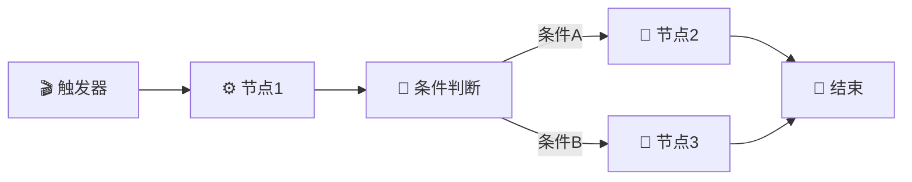
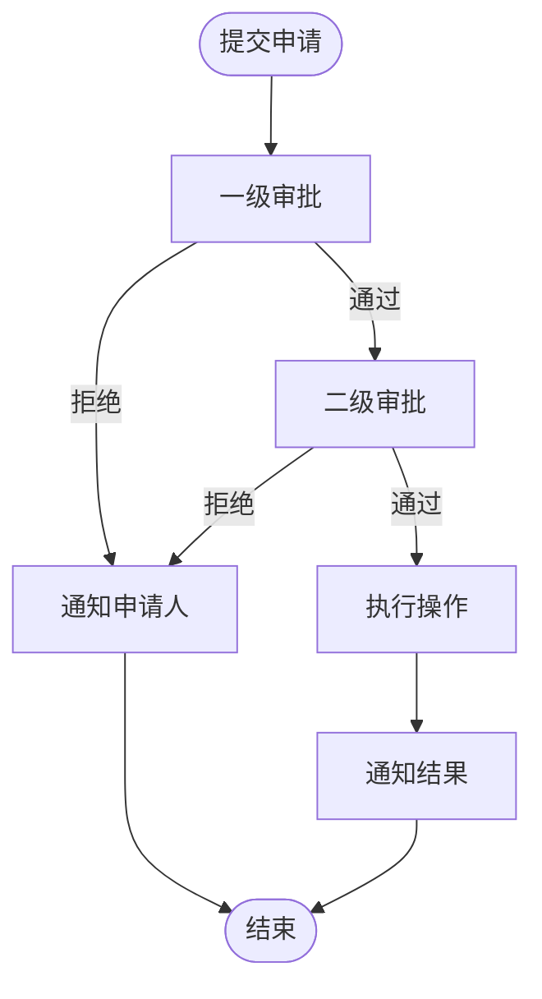

# 第9章：工作流编排（Workflow）

> 使用可视化编辑器构建复杂的自动化流程

---

## 9.1 工作流概念

### 什么是工作流

工作流（Workflow）是 OpenClaw 中的自动化引擎，通过可视化方式将多个操作步骤串联起来，实现复杂的业务逻辑。



### 工作流核心概念

| 概念 | 说明 | 示例 |
|------|------|------|
| **触发器** | 启动工作流的事件 | 定时触发、Webhook、消息事件 |
| **节点** | 工作流中的单个步骤 | 发送消息、调用 API、条件判断 |
| **连线** | 节点间的执行顺序 | 控制流程走向 |
| **变量** | 节点间传递的数据 | `{{trigger.message}}` |
| **上下文** | 工作流执行时的环境 | 用户信息、时间戳 |

---

## 9.2 触发器类型

### 定时触发（Cron）

```yaml
# 每天早8点发送早报
workflow:
  name: "每日早报"
  trigger:
    type: cron
    schedule: "0 8 * * *"  # 分 时 日 月 周
```

常用 Cron 表达式：

| 表达式 | 说明 |
|--------|------|
| `0 * * * *` | 每小时 |
| `0 */6 * * *` | 每6小时 |
| `0 9 * * 1-5` | 工作日早9点 |
| `0 0 * * 0` | 每周日午夜 |
| `0 0 1 * *` | 每月1号 |

### 事件触发

```yaml
# 收到特定消息时触发
workflow:
  name: "关键词回复"
  trigger:
    type: event
    event: message.received
    conditions:
      - field: message.content
        operator: contains
        value: "帮助"
```

### Webhook 触发

```yaml
# 外部系统调用触发
workflow:
  name: "外部通知处理"
  trigger:
    type: webhook
    path: /webhooks/alerts
    method: POST
    auth:
      type: hmac
      secret: ${WEBHOOK_SECRET}
```

---

## 9.3 内置节点详解

### 消息节点

```yaml
# 发送文本消息
- name: "发送欢迎消息"
  type: message.send
  channel: "{{trigger.channel}}"
  content: |
    你好 {{trigger.user.name}}！👋
    欢迎使用我们的服务。
```

### LLM 节点

```yaml
# 调用大模型生成内容
- name: "生成回复"
  type: llm.generate
  model: "deepseek-chat"
  prompt: |
    用户问题：{{trigger.message.content}}
    
    请根据以下知识库内容回答：
    {{steps.search_kb.result}}
    
    要求：简洁明了，不超过200字。
  output: "reply_content"
```

### 条件节点

```yaml
# 条件分支
- name: "判断用户类型"
  type: condition
  conditions:
    - if: "{{user.vip}} == true"
      then:
        - type: message.send
          content: "尊贵的VIP用户您好！"
    - if: "{{user.new}} == true"
      then:
        - type: workflow.call
          workflow: "onboarding"
    - else:
        - type: message.send
          content: "您好！"
```

### HTTP 请求节点

```yaml
# 调用外部 API
- name: "查询订单"
  type: http.request
  method: GET
  url: "https://api.example.com/orders/{{input.order_id}}"
  headers:
    Authorization: "Bearer {{secrets.api_token}}"
  output: "order_data"
```

### 数据库节点

```yaml
# 数据库操作
- name: "记录日志"
  type: database.insert
  table: "operation_logs"
  data:
    user_id: "{{trigger.user.id}}"
    action: "{{trigger.action}}"
    timestamp: "{{now}}"
```

### 循环节点

```yaml
# 遍历处理
- name: "批量发送"
  type: loop
  for_each: "{{steps.get_users.list}}"
  do:
    - type: message.send
      channel: "{{item.channel}}"
      content: "您好 {{item.name}}，{{steps.generate_message.content}}"
```

---

## 9.4 复杂工作流案例

### 案例一：多步骤审批流程



```yaml
# workflows/approval.yaml
workflow:
  name: "费用报销审批"
  
  trigger:
    type: event
    event: form.submitted
    form_id: expense_claim
  
  steps:
    # 1. 记录申请
    - name: "创建审批记录"
      type: database.insert
      table: "approvals"
      data:
        applicant: "{{trigger.user.id}}"
        amount: "{{trigger.data.amount}}"
        reason: "{{trigger.data.reason}}"
        status: "pending"
        created_at: "{{now}}"
      output: "approval_id"
    
    # 2. 一级审批（部门经理）
    - name: "发送一级审批通知"
      type: message.send
      channel: "feishu"
      to: "{{trigger.user.manager_id}}"
      content: |
        📋 新的报销申请待审批
        
        申请人：{{trigger.user.name}}
        金额：¥{{trigger.data.amount}}
        事由：{{trigger.data.reason}}
        
        回复"通过 {{steps.create_approval_record.id}}"或"拒绝 {{steps.create_approval_record.id}} 原因"
    
    # 3. 等待一级审批
    - name: "等待一级审批"
      type: wait
      timeout: 24h
      on_timeout:
        - type: message.send
          to: "{{trigger.user.id}}"
          content: "您的申请因超时未审批，已自动转交上级"
    
    # 4. 判断一级审批结果
    - name: "判断一级审批结果"
      type: condition
      conditions:
        - if: "{{input.action}} == '通过'"
          then:
            # 5a. 二级审批（财务）
            - name: "发送二级审批通知"
              type: message.send
              channel: "feishu"
              to: "finance@company.com"
              content: |
                💰 报销申请待财务审批
                
                申请人：{{trigger.user.name}}
                金额：¥{{trigger.data.amount}}
                部门经理已审批通过
            
            - name: "等待二级审批"
              type: wait
              timeout: 48h
            
            - name: "判断二级审批结果"
              type: condition
              conditions:
                - if: "{{input.action}} == '通过'"
                  then:
                    # 6a. 执行报销
                    - name: "执行报销"
                      type: http.request
                      method: POST
                      url: "https://erp.company.com/api/expenses"
                      body:
                        approval_id: "{{steps.create_approval_record.id}}"
                        amount: "{{trigger.data.amount}}"
                    
                    - name: "更新状态为已通过"
                      type: database.update
                      table: "approvals"
                      where:
                        id: "{{steps.create_approval_record.id}}"
                      set:
                        status: "approved"
                    
                    - name: "通知申请人通过"
                      type: message.send
                      to: "{{trigger.user.id}}"
                      content: "✅ 您的报销申请已通过审批，款项将在3个工作日内到账"
                
                - else:
                    - name: "更新状态为已拒绝"
                      type: database.update
                      table: "approvals"
                      where:
                        id: "{{steps.create_approval_record.id}}"
                      set:
                        status: "rejected"
                        reason: "{{input.reason}}"
                    
                    - name: "通知申请人拒绝"
                      type: message.send
                      to: "{{trigger.user.id}}"
                      content: "❌ 您的报销申请未通过财务审批。原因：{{input.reason}}"
        
        - else:
            # 5b. 一级审批拒绝
            - name: "更新状态为已拒绝"
              type: database.update
              table: "approvals"
              where:
                id: "{{steps.create_approval_record.id}}"
              set:
                status: "rejected"
                reason: "{{input.reason}}"
            
            - name: "通知申请人拒绝"
              type: message.send
              to: "{{trigger.user.id}}"
              content: "❌ 您的报销申请未通过部门审批。原因：{{input.reason}}"
```

### 案例二：数据 ETL 流程

```yaml
# workflows/data-etl.yaml
workflow:
  name: "每日数据同步"
  
  trigger:
    type: cron
    schedule: "0 2 * * *"  # 每天凌晨2点
  
  steps:
    # 1. 从源系统抽取数据
    - name: "抽取销售数据"
      type: http.request
      method: GET
      url: "https://crm.company.com/api/sales"
      params:
        date: "{{yesterday}}"
      output: "sales_data"
    
    # 2. 数据清洗
    - name: "清洗数据"
      type: code.execute
      language: python
      code: |
        import json
        
        data = json.loads('{{steps.extract_sales_data.body}}')
        cleaned = []
        
        for record in data:
          # 去除空值
          if record.get('amount') and record.get('customer_id'):
            # 标准化日期格式
            record['date'] = record['date'][:10]
            cleaned.append(record)
        
        return json.dumps(cleaned)
      output: "cleaned_data"
    
    # 3. 数据转换
    - name: "转换格式"
      type: loop
      for_each: "{{steps.clean_data.result}}"
      do:
        - type: database.insert
          table: "sales_report"
          data:
            date: "{{item.date}}"
            customer_id: "{{item.customer_id}}"
            amount: "{{item.amount}}"
            product: "{{item.product_name}}"
            region: "{{item.region}}"
    
    # 4. 生成报表
    - name: "生成日报"
      type: database.query
      sql: |
        SELECT 
          region,
          COUNT(*) as order_count,
          SUM(amount) as total_amount
        FROM sales_report
        WHERE date = '{{yesterday}}'
        GROUP BY region
      output: "report_data"
    
    # 5. 发送报表
    - name: "发送日报"
      type: message.send
      channel: "feishu"
      to: "sales-team@company.com"
      content: |
        📊 昨日销售日报 ({{yesterday}})
        
        {{#steps.generate_report.result}}
        • {{region}}: {{order_count}}单，¥{{total_amount}}
        {{/steps.generate_report.result}}
        
        详细数据请查看 BI 系统
```

### 案例三：智能客服工作流

```yaml
# workflows/smart-support.yaml
workflow:
  name: "智能客服处理"
  
  trigger:
    type: event
    event: message.received
    channel: wechat
  
  steps:
    # 1. 意图识别
    - name: "识别用户意图"
      type: llm.classify
      model: "deepseek-chat"
      input: "{{trigger.message.content}}"
      categories:
        - "产品咨询"
        - "技术支持"
        - "投诉建议"
        - "订单查询"
        - "其他"
      output: "intent"
    
    # 2. 根据意图路由
    - name: "意图路由"
      type: condition
      conditions:
        - if: "{{steps.intent_recognition.result}} == '订单查询'"
          then:
            - name: "提取订单号"
              type: llm.extract
              model: "deepseek-chat"
              input: "{{trigger.message.content}}"
              extract: "order_id"
              output: "order_id"
            
            - name: "查询订单"
              type: skill.call
              skill: "order_query"
              method: "get_order"
              params:
                order_id: "{{steps.extract_order_id.order_id}}"
              output: "order_info"
            
            - name: "回复订单信息"
              type: message.send
              content: |
                您的订单信息：
                订单号：{{steps.query_order.result.order_id}}
                状态：{{steps.query_order.result.status}}
                预计送达：{{steps.query_order.result.estimated_delivery}}
        
        - if: "{{steps.intent_recognition.result}} == '技术支持'"
          then:
            - name: "搜索知识库"
              type: skill.call
              skill: "knowledge_base"
              method: "search"
              params:
                query: "{{trigger.message.content}}"
              output: "kb_result"
            
            - name: "生成技术回复"
              type: llm.generate
              model: "deepseek-chat"
              prompt: |
                用户问题：{{trigger.message.content}}
                
                知识库相关内容：
                {{steps.search_kb.result}}
                
                请生成专业、易懂的技术支持回复。
              output: "tech_reply"
            
            - name: "发送技术回复"
              type: message.send
              content: "{{steps.generate_tech_reply.result}}"
        
        - if: "{{steps.intent_recognition.result}} == '投诉建议'"
          then:
            - name: "创建工单"
              type: skill.call
              skill: "ticket_system"
              method: "create"
              params:
                type: "complaint"
                content: "{{trigger.message.content}}"
                user_id: "{{trigger.user.id}}"
              output: "ticket"
            
            - name: "通知客服团队"
              type: message.send
              channel: "feishu"
              to: "support@company.com"
              content: |
                🚨 新的投诉工单
                
                工单号：{{steps.create_ticket.result.id}}
                用户：{{trigger.user.name}}
                内容：{{trigger.message.content}}
            
            - name: "回复用户"
              type: message.send
              content: |
                您好，您的反馈已收到。
                工单号：{{steps.create_ticket.result.id}}
                我们的客服专员将在24小时内与您联系。
        
        - else:
            - name: "通用回复"
              type: llm.generate
              model: "deepseek-chat"
              prompt: |
                用户消息：{{trigger.message.content}}
                
                请生成友好、有帮助的回复。如果不确定如何回答，
                建议用户联系人工客服。
              output: "general_reply"
            
            - name: "发送回复"
              type: message.send
              content: "{{steps.generate_general_reply.result}}"
```

---

## 9.5 工作流 API 调用

### 通过 API 触发工作流

```bash
# 触发工作流
curl -X POST "https://your-openclaw.com/api/v1/workflows/{workflow_id}/trigger" \
  -H "Authorization: Bearer ${API_TOKEN}" \
  -H "Content-Type: application/json" \
  -d '{
    "data": {
      "user_id": "user_123",
      "message": "Hello"
    }
  }'
```

### 查询工作流执行状态

```bash
# 查询执行状态
curl "https://your-openclaw.com/api/v1/workflow-runs/{run_id}" \
  -H "Authorization: Bearer ${API_TOKEN}"
```

### 响应示例

```json
{
  "id": "run_xxx",
  "workflow_id": "wf_xxx",
  "status": "completed",
  "started_at": "2024-01-15T08:00:00Z",
  "completed_at": "2024-01-15T08:00:05Z",
  "steps": [
    {
      "name": "发送消息",
      "status": "completed",
      "output": {
        "message_id": "msg_xxx"
      }
    }
  ]
}
```

---

## 9.6 本章小结

本章讲解了工作流编排的核心要点：

1. **触发器类型**：定时、事件、Webhook
2. **内置节点**：消息、LLM、条件、HTTP、数据库、循环
3. **复杂案例**：多步骤审批、数据 ETL、智能客服
4. **API 调用**：通过 API 触发和查询工作流

**最佳实践**：
- 将复杂业务拆分为多个小工作流
- 使用条件节点处理分支逻辑
- 设置合理的超时时间
- 添加错误处理和重试机制

---

## 参考配置

```yaml
# workflow-template.yaml
workflow:
  name: "模板工作流"
  
  trigger:
    type: cron
    schedule: "0 * * * *"
  
  steps:
    - name: "步骤1"
      type: message.send
      content: "Hello"
    
    - name: "条件判断"
      type: condition
      conditions:
        - if: "{{condition}}"
          then:
            - type: message.send
              content: "条件成立"
        - else:
            - type: message.send
              content: "条件不成立"
```
